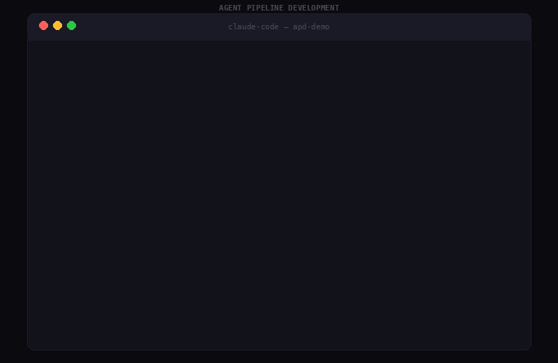
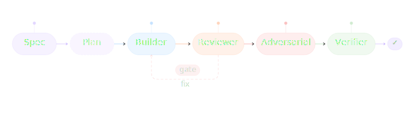
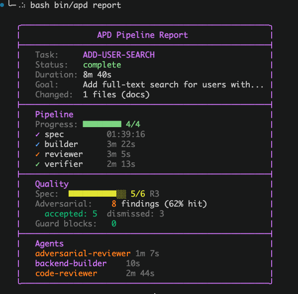

<p align="center">
  
</p>

<p align="center">
  Enforced multi-agent pipelines with mechanical guardrails for AI-assisted software development.<br>
  Works with <b>Claude Code</b> and <b>OpenAI Codex</b>.
</p>

<p align="center">
  <a href="GETTING-STARTED.md"><b>Getting Started</b></a> &middot;
  <a href="https://zstevovich.github.io/claude-apd/demo/"><b>Interactive Demo</b></a> &middot;
  <a href="https://zstevovich.github.io/claude-apd/pipeline-runs/"><b>Pipeline Runs</b></a> &middot;
  <a href="CHANGELOG.md"><b>Changelog</b></a>
</p>

<p align="center">
  <b>v5.0.0</b> &middot; MIT &middot; macOS + Linux
</p>



---

## What is APD?

APD enforces a disciplined workflow where specialised agents build code through a gated pipeline. Every step is mechanically enforced — hooks block violations, not documentation.

```
Spec → Builder → Reviewer → [Adversarial] → Verifier → Commit
```

- **Agent** — work divided among specialised agents with scoped permissions
- **Pipeline** — gated flow with mechanical enforcement at every step
- **Development** — one feature = one pipeline cycle = one commit

## Quick start

**Claude Code:**
```bash
/plugin marketplace add zstevovich/claude-apd          # one time
/plugin install claude-apd@zstevovich-plugins          # per project
/apd-setup                                             # configure
bash .claude/bin/apd verify                            # check setup
```

**Codex (OpenAI):**
```bash
# Prerequisites: brew install uv jq   +   codex features enable codex_hooks
git clone https://github.com/zstevovich/claude-apd ~/apd && \
    export PATH="$HOME/apd/bin:$PATH"                  # one-time, until openai/codex#18258 ships
apd cdx init                                           # scaffold .codex/ + .apd/ + AGENTS.md
apd cdx agents add code-reviewer                       # populate agents
apd cdx agents add backend-builder src/ config/
apd cdx skills install                                 # symlink phase skills into ~/.codex/skills/
apd cdx doctor                                         # audit setup
codex                                                  # start session; "run apd_ping"
```

> Codex 0.121.0 has no working plugin marketplace install for non-curated plugins (openai/codex#18258 — Codex registers the manifest but never completes the runtime install). APD's marketplace manifest is correct and ready (`<repo-root>/.agents/plugins/marketplace.json`); once the upstream fix ships, `codex marketplace add zstevovich/claude-apd` will replace the git-clone with no APD-side change.

See [Getting Started](GETTING-STARTED.md) for both walkthroughs.

## Five roles

| Role | Model | Effort | Responsibility |
|------|-------|--------|----------------|
| **Orchestrator** | opus | max | Coordinates pipeline, writes spec, dispatches agents, commits |
| **Builder** | sonnet | xhigh | Implements code per spec, scoped to specific files |
| **Reviewer** | opus | max | Finds bugs, security issues, edge cases (read-only) |
| **Adversarial Reviewer** | sonnet | max | Context-free review — no spec knowledge, fresh perspective |
| **Verifier** | — | — | Script: build + test + spec traceability check |

## Pipeline flow

<p align="center">
  
</p>

### Pipeline commands

```bash
apd pipeline spec "Task name"     # Start task (requires spec-card.md with R* criteria)
apd pipeline builder              # Advance after builder (requires implementation-plan.md)
apd pipeline reviewer             # Advance after review
apd pipeline verifier             # Run verification (spec traceability + build + test)
apd pipeline status               # Show current state
apd pipeline rollback             # Undo last step
apd pipeline reset                # Clear pipeline (start fresh)
apd pipeline metrics              # Performance dashboard
apd pipeline stats                # Skip log
apd doctor                        # Full diagnostics
apd verify                        # Setup verification (50+ checks)
```

All commands via `bash .claude/bin/apd <command>` (CC) or `bash .codex/bin/apd <command>` (Codex) — the shortcut each runtime's installer scaffolds. User-facing framework messages auto-select the correct path.

### Pipeline report

Full pipeline recap — available after any run or on demand:

```bash
apd report              # Current/last run
apd report --history    # All runs with trends and stats
```

<p align="center">
  
</p>

Shows task info, step timing, spec coverage bar, adversarial findings, guard blocks, and agent durations. History mode adds success rate, trend analysis, session stats, and adversarial insights.

## Mechanical enforcement

Every rule is backed by a hook script that **blocks** violations. No bypass from within Claude Code.

| What is blocked | Guard |
|----------------|-------|
| Commit without all 4 pipeline steps | `pipeline-gate` |
| Orchestrator writes code files directly | `guard-orchestrator` |
| Agent writes outside its scope | `guard-scope` |
| Bash writes to pipeline state (.done, .agents) | `guard-bash-scope` + `guard-pipeline-state` |
| Direct Write/Edit to .apd/pipeline/ state files | `guard-pipeline-state` |
| `git commit` without `APD_ORCHESTRATOR_COMMIT=1` | `guard-git` |
| `git add .` / mass staging | `guard-git` |
| `--no-verify` / force push / destructive git ops | `guard-git` |
| Lock file modification | `guard-lockfile` |
| Access to sensitive files (.env, .pem, credentials) | `guard-secrets` |
| Superpowers agents replacing APD roles | `pipeline-advance` (agent type check) |
| Spec modified mid-pipeline | `pipeline-advance` (sha256 hash freeze) |
| More than 7 acceptance criteria per spec | `pipeline-advance` (forces decomposition) |
| Builder dispatch without implementation plan | `pipeline-advance` (hard block) |
| Pipeline step forgery | Compiled Go binary creates HMAC-signed .done files — orchestrator cannot forge signatures |
| SendMessage during pipeline | guard-send-message blocks — must use Agent() for tracked dispatch |

## Spec traceability

Acceptance criteria get R* IDs. Builders add `@trace R*` markers in test files. Verification blocks commit if any criterion lacks test coverage.

```markdown
# .apd/pipeline/spec-card.md
**Acceptance criteria:**
- R1: Login endpoint returns JWT
- R2: Invalid credentials return 401
- R3: Password compared via bcrypt
```

```typescript
// @trace R1 R2
test('login returns JWT on valid credentials', () => { ... });
test('login returns 401 on invalid credentials', () => { ... });

// @trace R3
test('password verified via bcrypt', () => { ... });
```

## Implementation plan

Orchestrator writes `.apd/pipeline/implementation-plan.md` before dispatching builder — lists files to change with 1-2 sentences each, plus `### Agents` section.

```markdown
## Implementation Plan: Add user login

### Agents
- backend-api

### Files to create
- `src/Auth/LoginHandler.cs` — POST endpoint, validates credentials, returns JWT

### Files to modify
- `src/Auth/AuthModule.cs` — register the new endpoint
```

## Project structure

### Plugin (installed via `/plugin install`)

```
${CLAUDE_PLUGIN_ROOT}/
├── bin/
│   ├── apd                        # Single entry point
│   ├── core/                      # All executable scripts (no .sh)
│   │   ├── pipeline-advance       # Pipeline state machine
│   │   ├── pipeline-doctor        # Diagnostics
│   │   ├── pipeline-gate          # Commit gate
│   │   ├── guard-git              # Git operations guard
│   │   ├── guard-scope            # File scope per agent
│   │   ├── guard-bash-scope       # Bash write protection
│   │   ├── guard-orchestrator     # Blocks orchestrator code writes
│   │   ├── guard-pipeline-state   # Protects .apd/pipeline/ state files
│   │   ├── guard-secrets          # Sensitive file protection
│   │   ├── guard-lockfile         # Lock file protection
│   │   ├── verify-trace           # Spec traceability checker
│   │   ├── verify-apd             # Full setup verification
│   │   ├── verify-contracts       # Cross-layer type checker
│   │   ├── track-agent            # Agent lifecycle tracking
│   │   ├── gh-sync                # GitHub Projects sync
│   │   ├── session-start          # Context loader + self-healing
│   │   └── ...
│   ├── compiled/                  # Go binaries (validate-agent)
│   └── lib/                       # Shared libraries (.sh)
│       ├── resolve-project.sh
│       └── style.sh
├── hooks/hooks.json               # Plugin hook definitions
├── rules/workflow.md              # Pipeline workflow rules
├── templates/                     # Agent + project templates (CC + Codex scaffold)
├── skills/                        # 8 skills (brainstorm, tdd, debug, finish, setup, audit, github, miro)
├── mcp/apd_mcp_server.py          # Codex MCP server (8 tools)
├── plugins/apd/                   # Codex plugin package (canonical)
│   ├── .codex-plugin/plugin.json  #   plugin manifest
│   └── skills/                    #   4 phase skills (apd-brainstorm/tdd/debug/finish)
└── .agents/plugins/marketplace.json   # Codex marketplace manifest → ./plugins/apd
```

### Your project — CC install (generated by `/apd-setup`)

```
my-project/
├── CLAUDE.md                      # Project instructions
├── .claude/
│   ├── agents/                    # One .md per agent with scoped hooks
│   ├── bin/apd                    # Shortcut to plugin entry point
│   ├── scripts/verify-all.sh      # Build + test commands (project-specific)
│   ├── rules/                     # workflow.md + principles.md
│   └── memory/                    # Session log, status, metrics
├── .apd/
│   └── pipeline/                  # Ephemeral pipeline state (gitignored)
└── docs/adr/                      # Architecture Decision Records
```

### Your project — Codex install (generated by `apd cdx init`)

```
my-project/
├── AGENTS.md                      # Codex project-context (analogue of CLAUDE.md)
├── .codex/
│   ├── config.toml                # MCP server + feature flags
│   ├── hooks.json                 # PreToolUse Bash → guard-bash-scope
│   └── bin/apd                    # Shortcut to plugin entry point
├── .apd/
│   ├── config                     # Activation marker (PROJECT_NAME, STACK)
│   ├── .apd-version               # Plugin version tag
│   ├── rules/workflow.md          # Pipeline workflow (paths rewritten to .codex/)
│   ├── memory/                    # MEMORY.md, status.md, session-log.md
│   ├── agents/                    # Populated with `apd cdx agents add <name>`
│   └── pipeline/                  # Ephemeral pipeline state (gitignored)
└── docs/adr/                      # Architecture Decision Records
```

Hybrid projects (both runtimes on one repo) keep the CC layout intact — the Codex installer detects `.claude/` and skips the `.apd/` scaffold.

## Integrations (optional)

| Integration | What it does | Setup |
|-------------|-------------|-------|
| **GitHub Projects** | Auto-syncs pipeline steps to board columns (Spec → In Progress → Review → Testing → Done) | Configure `.mcp.json` + `gh auth login` |
| **Figma** | Frontend builders get design context via MCP | Configure Figma MCP server |
| **Miro** | Orchestrator reads boards for spec input, pushes pipeline dashboard | `claude mcp add --transport http miro https://mcp.miro.com` |

## Human gate

User MUST approve before: API changes, database migrations, auth/role logic, deploy to production.

## Agent scope example

```yaml
# .claude/agents/backend-api.md
hooks:
  PreToolUse:
    - matcher: "Write|Edit"
      hooks:
        - type: command
          command: "bash ${CLAUDE_PLUGIN_ROOT}/bin/adapter/cc/guard-scope src/ tests/"
```

Agent writing to `apps/frontend/App.tsx`:
```
BLOCKED: File apps/frontend/App.tsx is outside the allowed scope.
Allowed paths: src/ tests/
```

## Skills (Claude Code)

| Skill | When | Required? |
|-------|------|-----------|
| `/apd-brainstorm` | Before spec — vague or complex task | Mandatory |
| `/apd-tdd` | During builder implementation | Mandatory |
| `/apd-debug` | On verifier failure or critical review finding | Mandatory |
| `/apd-finish` | After successful commit | Mandatory |
| `/apd-setup` | Project initialization and maintenance | On setup |
| `/apd-audit` | Qualitative framework audit | Optional |
| `/apd-github` | GitHub Projects board sync | Optional |
| `/apd-miro` | Miro dashboard updates | Optional |

## Codex adapter surface

| Command | Purpose |
|---------|---------|
| `apd cdx init` | Scaffold `.codex/` + `.apd/` + `AGENTS.md` on the project |
| `apd cdx agents list` | Show available templates and installed agents |
| `apd cdx agents add <name> [scope ...]` | Scaffold an agent definition (5 templates available) |
| `apd cdx doctor` | Runtime-aware audit of the pure-Codex setup |
| `apd cdx test` | E2E smoke test (~75 checks, runs without Codex CLI) |

Codex uses an MCP server (`mcp/apd_mcp_server.py`) that exposes the pipeline as 8 MCP tools: `apd_ping`, `apd_doctor`, `apd_advance_pipeline`, `apd_guard_write`, `apd_verify_step`, `apd_adversarial_pass`, `apd_list_agents`, `apd_pipeline_state`. The orchestrator on Codex plays all roles inline — there is no sub-agent dispatch like on CC — and scope enforcement happens through `apd_guard_write(apd_role, file_path)`, which reads each role's scope server-side from the agent registry instead of trusting client arguments.

## Real-world results

See [Pipeline Runs](https://zstevovich.github.io/claude-apd/pipeline-runs/) for tracked production results with metrics.

## Plugin compatibility

APD mechanically blocks `superpowers:*` agents — the two pipelines are incompatible. APD includes its own equivalents: brainstorming, TDD, debugging, code review, verification, and finish workflows.

Other plugins (Figma, context7, etc.) work alongside APD without conflicts.

## License

MIT — Zoran Stevovic
