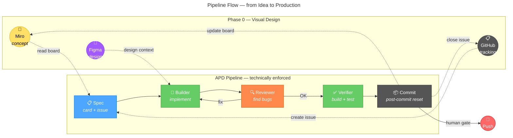

# Agent Pipeline Development (APD) Framework v3.5.0

Disciplined AI-assisted software development through specialised agents, enforced pipelines, and mechanical guardrails. Distributed as a Claude Code plugin.

[**▶ Interactive Demo**](https://zstevovich.github.io/claude-apd/demo/) | [**Getting Started**](GETTING-STARTED.md)


## What is APD?

APD is a workflow for AI-assisted software development where:
- **Agent** — work is divided among specialised agents with clear domains, not a single generic AI
- **Pipeline** — a defined flow with phases, verifications, and gates that cannot be skipped
- **Development** — software development as the end goal

## Full chain: from idea to code

```mermaid
---
title: "APD Architecture — 20 Patterns in 4 Layers"
---
graph TB
    subgraph MC ["📝 MEMORY & CONTEXT"]
        direction TB
        MC1["<b>1. Persistent Instructions</b><br/>CLAUDE.md — always in context<br/>never compressed"]
        MC2["<b>2. Tiered Memory</b><br/>MEMORY.md → status.md<br/>→ session-log → metrics"]
        MC3["<b>3. Auto-Summary</b><br/>git diff + guard-audit.log<br/>+ timestamps → populated entry"]
        MC4["<b>4. Dream Consolidation</b><br/>rotation archives + meta-summary<br/>tasks · problems · rules"]
        MC5["<b>5. Self-Healing Start</b><br/>auto chmod · stale reset<br/>conflict detect · context load"]
    end

    subgraph PO ["⚙️ PIPELINE & ORCHESTRATION"]
        direction TB
        PO1["<b>6. Spec-Driven Pipeline</b><br/>Spec → Builder → Reviewer<br/>→ Verifier → Commit"]
        PO2["<b>7. Four Roles</b><br/>Orchestrator · Builder<br/>Reviewer · Verifier"]
        PO3["<b>8. Pipeline Enforcement</b><br/>.done flags + gate check<br/>all 4 required for commit"]
        PO4["<b>9. Rollback & Recovery</b><br/>step-back · stale detection<br/>session-log gate"]
        PO5["<b>10. Metrics Dashboard</b><br/>per-step timing · skip rate<br/>bottleneck detection"]
    end

    subgraph GP ["🛡️ GUARDS & PERMISSIONS"]
        direction TB
        GP1["<b>11. Git Guard</b><br/>commit · push · staging<br/>force · destructive · AI sig"]
        GP2["<b>12. Scope Guard</b><br/>per-agent file isolation<br/>Write/Edit path enforcement"]
        GP3["<b>13. Runtime Write Guard</b><br/>node · python · ruby<br/>php · perl detection"]
        GP4["<b>14. Secrets Guard</b><br/>Read + Write + Edit + Bash<br/>.env · .pem · credentials"]
        GP5["<b>15. Contract Verification</b><br/>TS + C# type parser<br/>nullable · missing · mismatch"]
    end

    subgraph IA ["🔗 INTEGRATIONS & AUTOMATION"]
        direction TB
        IA1["<b>16. Miro Integration</b><br/>board → spec · channels<br/>dashboard · architecture"]
        IA2["<b>17. Figma Integration</b><br/>design → builder · tokens<br/>get_design_context"]
        IA3["<b>18. GitHub Projects</b><br/>issue → board columns<br/>gh-sync.sh automation"]
        IA4["<b>19. Lifecycle Hooks</b><br/>SessionStart · PreToolUse<br/>PostToolUse · Notification"]
        IA5["<b>20. Agent ID Audit</b><br/>per-agent block logging<br/>effort frontmatter control"]
    end

    style MC fill:#e8f4fd,stroke:#4da6ff,color:#000
    style PO fill:#e8fde8,stroke:#66cc66,color:#000
    style GP fill:#fde8e8,stroke:#ff6666,color:#000
    style IA fill:#fdf4e8,stroke:#ff884d,color:#000

    style MC1 fill:#fff,stroke:#4da6ff,color:#000
    style MC2 fill:#fff,stroke:#4da6ff,color:#000
    style MC3 fill:#fff,stroke:#4da6ff,color:#000
    style MC4 fill:#fff,stroke:#4da6ff,color:#000
    style MC5 fill:#fff,stroke:#4da6ff,color:#000
    style PO1 fill:#fff,stroke:#66cc66,color:#000
    style PO2 fill:#fff,stroke:#66cc66,color:#000
    style PO3 fill:#fff,stroke:#66cc66,color:#000
    style PO4 fill:#fff,stroke:#66cc66,color:#000
    style PO5 fill:#fff,stroke:#66cc66,color:#000
    style GP1 fill:#fff,stroke:#ff6666,color:#000
    style GP2 fill:#fff,stroke:#ff6666,color:#000
    style GP3 fill:#fff,stroke:#ff6666,color:#000
    style GP4 fill:#fff,stroke:#ff6666,color:#000
    style GP5 fill:#fff,stroke:#ff6666,color:#000
    style IA1 fill:#fff,stroke:#ff884d,color:#000
    style IA2 fill:#fff,stroke:#ff884d,color:#000
    style IA3 fill:#fff,stroke:#ff884d,color:#000
    style IA4 fill:#fff,stroke:#ff884d,color:#000
    style IA5 fill:#fff,stroke:#ff884d,color:#000
```





Each step has a machine-readable source of truth — no one manually copies data from one tool to another:

| Phase | Tool | What it defines | Who reads it |
|-------|------|----------------|--------------|
| Concept | **Miro** | Flow, user journey, system architecture, wireframe | Orchestrator → generates spec |
| Design | **Figma** | UI components, tokens, colours, layout | Builder → implements UI |
| Implementation | **APD pipeline** | Code, tests, build | Builder → Reviewer → Verifier |

Miro and Figma are optional — APD works without them, but with them it covers the entire path from idea to code.

## APD Pipeline

Every implementation passes through all phases — no exceptions. The Reviewer is never skipped, not even for "trivial" changes.

Each step is **technically enforced** — hooks block the commit if steps have not been completed.

## Quick start

### Prerequisites

- [Claude Code](https://docs.anthropic.com/en/docs/claude-code) **v2.1.89+** (full feature set) or v2.1.32+ (minimum functional)
- `jq` installed (`brew install jq` on macOS, `apt install jq` on Linux) — required for hook scripts
- Git repository initialised

Version is checked automatically on session start and by `verify-apd.sh`.

### 1. Add the marketplace (one time)

```bash
/plugin marketplace add zstevovich/claude-apd
```

### 2. Install the plugin for your project

Open Claude Code **in your project directory** and install at **project scope**:

```bash
/plugin install claude-apd@zstevovich-plugins
```

When prompted, select **"Install for all collaborators on this repository (project scope)"**. This writes to `.claude/settings.json` — committed to git, shared with the team. Plugin hooks only fire in this project.

### 3. Run APD Init

Start a new Claude Code session, then run:
```
/apd-setup
```

> **Note:** Start a new session after installing the plugin — skills register on session start.

The skill will guide you through configuration — project name, stack, paths, agents. It generates:
- `CLAUDE.md` — project instructions
- `.claude/agents/` — agent definitions with scope guards
- `.claude/rules/principles.md` — code conventions
- `.claude/scripts/verify-all.sh` — build/test commands (the only script in your project)
- `.claude/memory/` — memory files
- `.claude/.apd-config` — project configuration

### 3. Verify

```bash
bash ${CLAUDE_PLUGIN_ROOT}/scripts/verify-apd.sh
```

The verification runs 50+ checks across 10 categories (prerequisites, structure, hooks, guards, pipeline E2E, and more).

`verify-apd.sh` tests 10 categories:

| # | Category | What it checks |
|---|----------|----------------|
| 1 | Prerequisites | jq, git, git repo |
| 2 | Structure | Directories, scripts (executable), memory files |
| 3 | Settings | Hook registration, attribution empty |
| 4 | Placeholders | No `{{...}}` must remain |
| 5 | CLAUDE.md | Required sections (Stack, APD, Pipeline, Guardrails...) |
| 6 | Agents | Frontmatter, model, guard-scope/git/secrets registered |
| 7 | Guard tests | Functionally tests each guard (blocks/allows) |
| 8 | Pipeline E2E | Spec → Builder → Reviewer → Verifier → gate pass + rollback |
| 9 | verify-all.sh | Whether build/test commands are configured |
| 10 | Gitignore | .pipeline/ and settings.local.json protected |

For a quick static check (without functional tests):
```bash
bash ${CLAUDE_PLUGIN_ROOT}/scripts/test-hooks.sh
```

## Four roles

### Orchestrator (Claude Code — main session)
Central coordinator that manages the entire pipeline:
- Creates the spec card and shares it with the user before implementation
- Dispatches Builder agents (in parallel where possible)
- Automatically triggers the Reviewer after each implementation
- Triggers the Verifier before committing
- **Only one** that commits and pushes (uses the `APD_ORCHESTRATOR_COMMIT=1` prefix)
- **Only one** that communicates with the user

### Builder (subagent)
Specialised agents that implement code according to the spec:
- One agent per domain (backend, frontend, mobile...)
- Max 3-4 edit operations per dispatch
- Clear file ownership — no overlap between agents
- **Must not** commit, push, or modify files outside its domain
- Defined in `.claude/agents/` with hooks that mechanically block violations

### Reviewer (subagent)
Finds bugs, risks, and gaps in the Builder's work:
- Triggered automatically after each Builder
- Looks for: regressions, edge cases, security holes, cross-layer mismatches
- Does **not** suggest style changes or refactoring outside scope

### Verifier (script)
Automatic verification before commit:
- Runs `verify-all.sh` (build + test)
- Triggered automatically through the `guard-git.sh` hook when the orchestrator attempts a commit
- Blocks the commit if build or tests fail

## Spec card

Before each task (regardless of size), the orchestrator creates a spec card:

```
## [Task name]
**Goal:** One sentence.
**Effort:** max | high
**Out of scope:** What we are NOT doing.
**Acceptance criteria:** List of conditions for "done".
**Affected modules:** Files/layers that change.
**Risks:** What can go wrong.
**Rollback:** How to revert if it breaks.
**Human gate:** Whether approval is required (API changes, migrations, auth, prod data).
**ADR:** ADR-NNNN | Required | N/A
```

The spec is shared with the user BEFORE implementation. The user approves or adjusts.

### Effort levels

| Effort | When | Who |
|--------|------|-----|
| **max** | Decisions that are expensive to reverse | Orchestrator, Reviewer, Verifier |
| **high** | Implementation following a clear spec | Builder agents |

## Human gate

The user MUST approve before:
- API changes (new endpoints, signature changes)
- Database migrations (new tables, column changes)
- Auth/role logic (authorisation changes)
- Deploy to staging/production
- Anything that affects production data

Format: the orchestrator presents a diff summary → the user says "ok" → only then does the action proceed.

## Mechanical enforcement

APD does not rely on instructions or documentation to enforce the pipeline. Every rule is backed by a hook script that **blocks** violations with exit code 2. There is no way to bypass the pipeline from within Claude Code.

| What is blocked | How | Script |
|----------------|-----|--------|
| Orchestrator writes code files | PreToolUse hook on Write/Edit | `guard-orchestrator.sh` |
| Builder step without agent dispatch | SubagentStop tracking | `track-agent.sh` + `pipeline-advance.sh` |
| Reviewer step without agent dispatch | Same mechanism | `track-agent.sh` + `pipeline-advance.sh` |
| Commit without all 4 pipeline steps | PreToolUse hook on git commit | `pipeline-gate.sh` |
| Agent writes outside its scope | Per-agent PreToolUse hook | `guard-scope.sh` |
| Superpowers agents replacing APD roles | Agent type check in pipeline-advance | `pipeline-advance.sh` |
| Skip command | **Removed** — does not exist | — |

### Agent model enforcement

Agent frontmatter fields (`model`, `effort`, `maxTurns`, `permissionMode`) are mechanically enforced by Claude Code — not advisory.

| Role | Model | Effort | Permission | maxTurns |
|------|-------|--------|------------|----------|
| Orchestrator | opus | max | — | — |
| Builder | sonnet | high | bypassPermissions | 20 |
| Reviewer | opus | max | **plan (read-only)** | 15 |

The reviewer **cannot modify files** — `permissionMode: plan` and no Write/Edit in tools list.

## Guardrail scripts

APD uses hook scripts that block violations even when an agent "forgets" the rules.

### Scripts (19)

All scripts live in the plugin (`${CLAUDE_PLUGIN_ROOT}/scripts/`) except `verify-all.sh` which lives in your project (`.claude/scripts/`).

| Script | Function |
|--------|----------|
| `guard-git.sh` | Blocks unauthorised git operations (commit/push only by orchestrator, no force push, no mass staging) |
| `guard-scope.sh` | Blocks Write/Edit outside the agent's scope |
| `guard-bash-scope.sh` | Blocks bash and runtime writes outside scope (shell redirects, node/python/ruby/php/perl) |
| `guard-secrets.sh` | Blocks access to sensitive files |
| `guard-lockfile.sh` | Blocks modification of lock files |
| `guard-orchestrator.sh` | **Blocks orchestrator from writing code files** — must dispatch a Builder agent. Uses stack from userConfig to determine code extensions |
| `guard-permission-denied.sh` | Handles permission denied events gracefully |
| `track-agent.sh` | **Records SubagentStart/SubagentStop events** — pipeline-advance.sh verifies agents actually ran before marking steps complete |
| `pipeline-advance.sh` | Pipeline flag system with timestamps, rollback, metrics. Rejects conflicting superpowers agents, accepts only project-defined agents |
| `pipeline-gate.sh` | Blocks commit without all 4 pipeline steps |
| `pipeline-post-commit.sh` | Auto-resets pipeline after successful commit |
| `rotate-session-log.sh` | Automatically archives old session log entries |
| `session-start.sh` | Loads project context at session start with self-healing (auto-fixes broken state) |
| `gh-sync.sh` | Synchronises pipeline steps with GitHub Projects issues |
| `test-hooks.sh` | Quick static check (files, JSON, placeholders) |
| `verify-apd.sh` | Full functional verification (80+ checks: guards, pipeline E2E, agents, summary) |
| `verify-contracts.sh` | Cross-layer type verification (TypeScript + C# parser, nullable awareness) |
| `verify-all.sh` | Build + test before commit (lives in project, not plugin) |
| `lib/resolve-project.sh` | Shared library — resolves PROJECT_DIR and APD_PLUGIN_ROOT |

### guard-git.sh — Git operations

PreToolUse hook on every Bash call. Blocks:

| Operation | Reason |
|-----------|--------|
| `git commit` without `APD_ORCHESTRATOR_COMMIT=1` prefix | Only the orchestrator may commit |
| `git push` without `APD_ORCHESTRATOR_COMMIT=1` prefix | Only the orchestrator may push |
| `git add .` / `git add -A` / `git add --all` / `git add -u` / `git add *` | Forces explicit file-by-file staging |
| `git commit -a` / `git commit --all` | Forces explicit staging before commit |
| `--no-verify` | Prevents bypassing hooks |
| `git reset --hard`, `git clean -f`, etc. | Blocks destructive operations |
| `Co-Authored-By` | Blocks AI signatures in commits |
| `git add .claude/` without prefix | Protects workflow files |

When it blocks a commit/push, it outputs the exact syntax the orchestrator should use.

### guard-scope.sh — File scope for agents

PreToolUse hook on Write/Edit calls in agent definitions. Each agent defines its allowed paths:

```yaml
# In the agent .md file:
hooks:
  PreToolUse:
    - matcher: "Write|Edit"
      hooks:
        - type: command
          command: "bash ${CLAUDE_PLUGIN_ROOT}/scripts/guard-scope.sh src/ tests/"
```

An agent that attempts to edit a file outside `src/` or `tests/` receives:
```
BLOCKED: File apps/frontend/App.tsx is outside the allowed scope.
Allowed paths: src/ tests/
```

### guard-bash-scope.sh — Bash write operations

Complements guard-scope.sh — blocks bash commands that write outside the allowed scope (redirect, `tee`, `sed -i`, `cp`, `mv`).

### guard-secrets.sh — Sensitive files

Blocks access to and reading of sensitive files: `.env.production`, `.pem`, `.key`, `credentials.json`, `service-account`, and others. Customisable for each stack.

### guard-lockfile.sh — Lock files

Blocks direct modification of lock files (`package-lock.json`, `pnpm-lock.yaml`, `yarn.lock`, `composer.lock`, `Cargo.lock`, `go.sum`, and others).

### verify-all.sh — Build and test verification

Runs automatically before each commit (called by `guard-git.sh`). Detects which files are being committed and runs the relevant checks:
- Backend changes → build + test commands
- Frontend changes → type check + test commands

**Important:** Ships with commented-out examples — must be configured for your build/test system.

### session-start.sh — Context at session start

SessionStart hook that loads:
- Current project status from `memory/status.md`
- Pipeline status
- Last 20 lines from `memory/session-log.md`
- Automatic session log rotation (keeps the last 10 entries)

## Pipeline in practice

```bash
# 1. Spec
bash ${CLAUDE_PLUGIN_ROOT}/scripts/pipeline-advance.sh spec "Implement user login"

# 2. Builder implements
# ... agent works ...
bash ${CLAUDE_PLUGIN_ROOT}/scripts/pipeline-advance.sh builder

# 3. Reviewer reviews
# ... code review ...
bash ${CLAUDE_PLUGIN_ROOT}/scripts/pipeline-advance.sh reviewer

# 4. Verifier (build + test)
# ... dotnet build && dotnet test ...
bash ${CLAUDE_PLUGIN_ROOT}/scripts/pipeline-advance.sh verifier

# 5. Commit (allowed only now)
APD_ORCHESTRATOR_COMMIT=1 git commit -m "feat: user login"

# Pipeline auto-resets and logs to session-log.md
```

### Pipeline commands

```bash
bash ${CLAUDE_PLUGIN_ROOT}/scripts/pipeline-advance.sh spec "Task name"
bash ${CLAUDE_PLUGIN_ROOT}/scripts/pipeline-advance.sh builder
bash ${CLAUDE_PLUGIN_ROOT}/scripts/pipeline-advance.sh reviewer
bash ${CLAUDE_PLUGIN_ROOT}/scripts/pipeline-advance.sh verifier
bash ${CLAUDE_PLUGIN_ROOT}/scripts/pipeline-advance.sh status
bash ${CLAUDE_PLUGIN_ROOT}/scripts/pipeline-advance.sh reset
bash ${CLAUDE_PLUGIN_ROOT}/scripts/pipeline-advance.sh rollback           # Revert one step back
bash ${CLAUDE_PLUGIN_ROOT}/scripts/pipeline-advance.sh stats
bash ${CLAUDE_PLUGIN_ROOT}/scripts/pipeline-advance.sh init "Description"  # First setup only
```

### Skip analysis

```bash
bash ${CLAUDE_PLUGIN_ROOT}/scripts/pipeline-advance.sh stats
# Pipeline statistics:
#   Total skips: 4
#   Last 5:
#   | 2026-04-03 | Pre-existing TS errors | pre-existing-debt |
```

If >30% of commits use skip — something in the pipeline needs fixing.

## ADR (Architecture Decision Records)

Architectural decisions are documented in `docs/adr/` with full context: why the decision was made, which alternatives were considered, and what the consequences are.

### When to create an ADR

- Introducing a new technology or library
- Changing API design or communication patterns
- Choosing between two valid architectural approaches
- Changing auth/security strategy
- Data migration or schema change

### Lifecycle

```
Proposed → Accepted → [Superseded (new ADR) | Withdrawn]
```

- `Proposed` — can be modified until accepted
- `Accepted` — **immutable**. If the decision changes, a new ADR is created that supersedes the old one
- Numbering: `0001`, `0002`, ... (4 digits with leading zeros)

### Relationship with principles.md

`principles.md` states **what** (rules), ADR states **why** (decision context):

```markdown
## Code
- Error handling: Result pattern (see ADR-0004)
- Architecture pattern: Vertical Slice (see ADR-0001)
```

## Creating agents

The `/apd-setup` skill automatically creates agents based on your project structure. To create agents manually, use the template from the plugin:

```bash
cp ${CLAUDE_PLUGIN_ROOT}/templates/agent-template.md .claude/agents/backend-builder.md
```

Replace:
- `{{agent-name}}` → `backend-builder`
- `{{SCOPE_PATHS}}` → `src/ tests/`
- `{{model}}` → `sonnet` (Builder) or `opus` (Reviewer/Verifier)

**Important:** If you do not replace `{{SCOPE_PATHS}}`, guard-scope.sh will block ALL Write/Edit operations for that agent.

### Typical agents by stack

#### .NET / C#
| Agent | Scope | Model |
|-------|-------|-------|
| backend-api | src/ tests/ | sonnet |
| database | src/Infrastructure/ | sonnet |
| backoffice | apps/backoffice/ | sonnet |
| mobile | apps/mobile/ | sonnet |
| testing | tests/ | sonnet |
| devops | docker/ .github/ | sonnet |

#### Node.js / TypeScript
| Agent | Scope | Model |
|-------|-------|-------|
| backend | server/ | sonnet |
| frontend | client/ | sonnet |
| testing | tests/ __tests__/ | sonnet |
| devops | docker/ .github/ | sonnet |

#### Java / Spring Boot
| Agent | Scope | Model |
|-------|-------|-------|
| backend-api | src/main/java/ src/test/ | sonnet |
| database | src/main/resources/db/ src/main/java/**/repository/ | sonnet |
| frontend | frontend/ | sonnet |
| mobile | mobile/ | sonnet |
| testing | src/test/ | sonnet |
| devops | docker/ .github/ | sonnet |

#### Python / Django
| Agent | Scope | Model |
|-------|-------|-------|
| backend | apps/ | sonnet |
| frontend | frontend/ templates/ static/ | sonnet |
| testing | tests/ | sonnet |
| devops | docker/ .github/ | sonnet |

#### Python / FastAPI
| Agent | Scope | Model |
|-------|-------|-------|
| backend | app/ | sonnet |
| frontend | frontend/ | sonnet |
| testing | tests/ | sonnet |
| devops | docker/ .github/ | sonnet |

#### Go
| Agent | Scope | Model |
|-------|-------|-------|
| backend | internal/ cmd/ | sonnet |
| frontend | web/ | sonnet |
| testing | internal/ cmd/ (test files) | sonnet |
| devops | docker/ .github/ deploy/ | sonnet |

#### PHP / Symfony
| Agent | Scope | Model |
|-------|-------|-------|
| symfony-builder | backend/src/ backend/tests/ | sonnet |
| frontend | web/ backoffice/ | sonnet |
| mobile | mobile/ | sonnet |
| devops | docker/ .github/ | sonnet |

### CQRS architecture — agents by responsibility

CQRS naturally divides code into a write (Command) side and a read (Query) side. APD enforces that boundary — guard-scope mechanically prevents the command agent from touching read models and vice versa.

#### CQRS agents — .NET (MediatR / Wolverine)

| Agent | Scope | Responsibility |
|-------|-------|----------------|
| command-builder | src/Commands/ src/Domain/ src/Validators/ | Command handlers, aggregates, validation |
| query-builder | src/Queries/ src/ReadModels/ | Query handlers, read models, projections |
| event-builder | src/Events/ src/Projections/ src/Subscribers/ | Event handlers, projections, denormalisation |
| infra-builder | src/Infrastructure/ src/Persistence/ | EventStore, MessageBus, repositories |
| testing | tests/ | Unit + integration tests |

#### CQRS agents — Java (Axon Framework / Spring)

| Agent | Scope | Responsibility |
|-------|-------|----------------|
| command-builder | src/main/java/**/command/ src/main/java/**/aggregate/ | Command handlers, aggregates |
| query-builder | src/main/java/**/query/ src/main/java/**/projection/ | Query handlers, projections |
| event-builder | src/main/java/**/event/ src/main/java/**/saga/ | Event handlers, sagas |
| infra-builder | src/main/java/**/config/ src/main/resources/ | Axon configuration, persistence |
| testing | src/test/ | Tests |

#### CQRS agents — Node.js (NestJS CQRS)

| Agent | Scope | Responsibility |
|-------|-------|----------------|
| command-builder | src/commands/ src/domain/ src/validators/ | Command handlers, aggregates |
| query-builder | src/queries/ src/read-models/ | Query handlers, read models |
| event-builder | src/events/ src/sagas/ | Event handlers, sagas |
| infra-builder | src/infrastructure/ src/config/ | EventStore, configuration |
| testing | test/ | Tests |

#### Spec card for CQRS — Command

```
## [CreateOrder Command]
**Type:** Command
**Goal:** Create an order with item availability validation.
**Handler:** OrderCommandHandler
**Aggregate:** OrderAggregate
**Validation:** OrderValidator — items exist, quantity > 0, user active.
**Emitted events:** OrderCreated, InventoryReserved
**Affected projections:** OrderSummaryView, InventoryView
**Out of scope:** Query side — we do not modify read models directly.
**Rollback:** Compensating event OrderCancelled if InventoryReserved fails.
```

#### Spec card for CQRS — Query

```
## [GetOrderSummary Query]
**Type:** Query
**Goal:** Display a summary view of an order from a denormalised read model.
**Handler:** OrderQueryHandler
**Read model:** OrderSummaryView
**Depends on events:** OrderCreated, OrderStatusChanged, OrderItemAdded
**Out of scope:** Command side — we do not modify aggregates.
**Risk:** Read model may be stale if the projection lags (eventual consistency).
```

#### CQRS cross-layer contract verification

Standard cross-layer verification (backend <-> frontend) for CQRS projects gains additional checks:

| Contract | Source of truth | Verification |
|----------|----------------|--------------|
| Command → Event | Event class | Every command handler must emit its declared events |
| Event → Projection | Event class | The projection must handle ALL events it consumes |
| Query → Read Model | Read Model class | Query response must match the read model structure |
| Read Model → Frontend | Read Model class | Frontend type must be 1:1 with the read model |

**Key rule:** Never create a frontend type from a specification or Figma design — always read the read model from code. The read model is the sole source of truth for the query side.

## Session memory

After each completed task, the orchestrator appends a record to `memory/session-log.md`:

```markdown
## [YYYY-MM-DD] [Task name]
**Status:** Completed | Partial | Blocked
**What was done:** [1-2 sentences]
**Issues:** [What went wrong, or "None"]
**Guardrail that helped:** [Which mechanism caught a problem, or "N/A"]
**New rule:** [What we are adding to workflow, or "None"]
```

If a new rule is identified, the orchestrator adds it immediately to the relevant rules file. Mistakes become guardrails.

Pipeline reset automatically adds a skeleton entry to session-log — the orchestrator fills in the details.

### Memory files

- `memory/MEMORY.md` — project memory index (always loaded, minimal context)
- `memory/session-log.md` — append-only log of completed tasks (with automatic rotation)
- `memory/status.md` — current project status (phase, focus, blockers)
- `memory/pipeline-skip-log.md` — skip metrics for analysis

## Cross-layer verification

When a task involves backend + frontend/mobile:

1. The backend DTO/response model is the **source of truth**
2. For each field, map the type to its frontend/mobile equivalent
3. Nullable fields must be nullable on all layers
4. Dates: always ISO 8601 string on the frontend/mobile side
5. **NEVER** create a frontend/mobile type from a specification — always read the backend DTO

Add a type mapping table for your stack to `workflow.md`.

## Figma integration (optional)

If the project has a Figma design, APD integrates it into the workflow:

1. **`/apd-setup`** asks for the Figma URL and configures `CLAUDE.md`
2. **CLAUDE.md** contains a Figma section with the link and rules
3. **Frontend Builder** uses Figma MCP (`get_design_context`, `get_screenshot`) for design context
4. **Skills** for the Figma workflow:

| Skill | When |
|-------|------|
| `figma:figma-implement-design` | Implementing UI from a Figma design |
| `figma:figma-generate-design` | Creating a design in Figma from code |
| `figma:figma-generate-library` | Design system / token library |
| `figma:figma-code-connect` | Mapping Figma components to code |
| `figma:figma-create-design-system-rules` | Generating design system rules |

**Rules when a Figma design exists:**
- Before implementing a UI component — always check the Figma design
- Design tokens and colours from Figma are the source of truth
- Do not invent values — use `get_design_context`
- If there is no Figma design — remove the Figma section from `CLAUDE.md`

## Miro integration (optional)

If the project uses Miro for specifications, architecture, or planning, APD integrates it into the workflow.

### Setup

```bash
claude mcp add --transport http miro https://mcp.miro.com
```

After that: `/mcp auth` for OAuth authentication with your Miro account.

Alternatively, install Miro skills:
```bash
npx skills add miroapp/miro-ai
```

### Capabilities

| Action | Description |
|--------|-------------|
| Read board | Structured summary — sticky notes, frames, diagrams, documents |
| Create diagram | From a text description, auto-detect type (flowchart, sequence, ER...) |
| Create document | Markdown document on the board |
| Create table | With typed columns |
| Explore board | List items by frames and types |

### How it fits into the APD pipeline

| APD phase | Miro role |
|-----------|-----------|
| **Pre-spec** | Orchestrator reads the Miro board → generates a spec card from sticky notes/frames |
| **Spec** | Wireframes and flow diagrams from the board as spec input |
| **Architecture** | System diagram on the board — a living document that gets updated |
| **Review** | Visualisation of the realised architecture after implementation |
| **Planning** | Task board with sticky notes → orchestrator parses into pipeline tasks |
| **Dashboard** | `/apd-miro` skill pushes pipeline status, metrics, and recent tasks to the board |

### Miro pipeline dashboard

The `/apd-miro` skill creates or updates a visual dashboard on the Miro board:
- **Pipeline status** — current step highlighted (spec/builder/reviewer/verifier)
- **Metrics** — average duration, fastest/slowest task, skip rate
- **Recent tasks** — last 5 tasks with durations and status

Invoke manually or configure automatic updates after each pipeline step.

### Channels — real-time push notifications

With Claude Code `--channels` (v2.1.80+), Miro can push board changes directly into your session:

```bash
claude --channels miro
```

This enables:
- **Board change alerts** — if someone updates the spec on the board, the orchestrator is notified immediately
- **CI/CD integration** — build results pushed to the board and into the session
- **Async human gate** — approve pipeline steps from Miro sticky notes

Requires Miro MCP server configured and authenticated.

**Rules when a Miro board exists:**
- Before creating a spec card — check whether relevant content exists on the board
- The Miro board is the source of truth for processes and architecture
- The orchestrator can create diagrams on the board for documentation
- If there is no Miro board — remove the Miro section from `CLAUDE.md`

## GitHub Projects integration (optional)

If the project uses GitHub Projects v2 for task tracking, APD maps pipeline phases directly to board columns.

### Setup

Ensure the GitHub MCP server is configured in `.mcp.json` (included in `.mcp.json.example`) and `gh` CLI is authenticated.

### Pipeline → board column mapping

| APD step | Board column | Action |
|----------|-------------|--------|
| `pipeline-advance.sh spec` | **Spec** | Create issue with spec card, add to board |
| `pipeline-advance.sh builder` | **In Progress** | Move issue to In Progress |
| `pipeline-advance.sh reviewer` | **Review** | Move issue to Review |
| `pipeline-advance.sh verifier` | **Testing** | Move issue to Testing |
| Successful commit | **Done** | Close issue, link commit, move to Done |
| `pipeline-advance.sh skip` | **Done** | Close issue with `apd-skip` label |

### Recommended board columns

| Column | Purpose |
|--------|---------|
| **Backlog** | Planned tasks (not yet in pipeline) |
| **Spec** | Spec card created, awaiting approval |
| **In Progress** | Builder working |
| **Review** | Reviewer examining |
| **Testing** | Verifier testing |
| **Done** | Committed and pushed |

### Recommended labels

- `apd-pipeline` — all APD-managed tasks
- `apd-skip` — tasks with skipped pipeline
- `human-gate` — tasks requiring manual approval

### Metrics from GitHub Projects

GitHub Projects tracks card movement history, providing:
- **Cycle time** — how long an issue takes from Spec to Done
- **Bottleneck detection** — which column holds cards the longest
- **Throughput** — issues closed per day/week

These complement `pipeline-advance.sh metrics` — GitHub gives the board-level view, the pipeline gives per-step timing.

The `/apd-github` skill automates the full flow. Invoke it or let the orchestrator manage cards automatically.

### Miro vs GitHub Projects

| | Miro | GitHub Projects |
|---|---|---|
| **Audience** | PO, designers, clients — visual | Developers — technical |
| **Content** | Wireframes, flows, architecture | Issues, PRs, status tracking |
| **Strength** | Creative work, brainstorming | Automation, closing the loop |
| **Coexistence** | Upstream (concept) | Downstream (implementation tracking) |

Both can coexist — Miro for upstream design, GitHub Projects for downstream execution.

## Memory — two systems

| | APD memory (`.claude/memory/`) | Claude auto memory (`~/.claude/projects/`) |
|---|---|---|
| **What it stores** | Project knowledge — status, session log, lessons learnt | User's personal preferences |
| **Who uses it** | Everyone on the project (orchestrator + agents) | Only that user on that machine |
| **Where it lives** | In the repository — committed | Locally — NOT committed |
| **Example** | "Auth middleware must use Redis sessions" | "User prefers short answers" |

## Rules vs Skills

| | Rules (`.claude/rules/`) | Skills (`.claude/skills/`) |
|---|---|---|
| **Loading** | Always, automatically for all agents | Explicitly, when an agent needs conventions |
| **Content** | Global rules and workflow | Convention snippets and procedures |
| **Example** | `workflow.md` — APD pipeline definition | Naming conventions for API endpoints |

## settings.json — Hook configuration

Defines automatic behaviour of the Claude Code session:

| Hook | Script | What it does |
|------|--------|--------------|
| `SessionStart` | `session-start.sh` | Loads project context (status, pipeline, last session) |
| `PreToolUse (Bash)` | `guard-git.sh` | Blocks unauthorised git operations |
| `PreToolUse (Write\|Edit)` | `guard-lockfile.sh` | Blocks modification of lock files |
| `PostToolUse (Bash)` | `pipeline-post-commit.sh` | Auto-resets pipeline after successful commit |
| `PostCompact` | `session-start.sh` | Re-injects context after context compression |
| `PermissionDenied` | `guard-permission-denied.sh` | Handles permission denied events |

Other settings:

- `CLAUDE_CODE_EXPERIMENTAL_AGENT_TEAMS: "1"` — enables agent teams
- `attribution.commit: ""` and `attribution.pr: ""` — empty, no AI signatures in commits

**Note:** `guard-scope.sh`, `guard-bash-scope.sh`, and `guard-secrets.sh` are NOT placed in `settings.json` (global) but only in individual agent `.md` files — because the orchestrator must have access to all files.

## Structure

APD v3.0 is a **plugin** — most files live in the plugin directory (`${CLAUDE_PLUGIN_ROOT}`), not in your project. Your project contains only the customised files.

### Plugin (installed via `/plugin install`)

```
${CLAUDE_PLUGIN_ROOT}/
├── scripts/
│   ├── lib/resolve-project.sh        # Shared path resolution library
│   ├── guard-git.sh                  # Git guardrail
│   ├── guard-scope.sh                # File scope guardrail
│   ├── guard-bash-scope.sh           # Bash write scope guardrail
│   ├── guard-secrets.sh              # Secrets guardrail
│   ├── guard-lockfile.sh             # Lock file guardrail
│   ├── guard-permission-denied.sh    # Permission denied handler
│   ├── pipeline-advance.sh           # Pipeline flag system
│   ├── pipeline-gate.sh              # Pipeline commit gate
│   ├── pipeline-post-commit.sh       # Post-commit pipeline reset
│   ├── rotate-session-log.sh         # Log rotation
│   ├── session-start.sh              # Context loader + self-healing
│   ├── gh-sync.sh                    # GitHub Projects sync
│   ├── verify-apd.sh                 # Full verification (50+ checks)
│   ├── verify-contracts.sh           # Cross-layer type verification
│   ├── verify-all.sh                 # Template for build/test
│   └── test-hooks.sh                 # Quick static check
├── hooks/hooks.json               # Plugin hook configuration
├── rules/workflow.md                 # APD workflow (universal)
├── templates/agent-template.md       # Agent template (not in agents/ to avoid auto-discovery)
├── skills/
│   ├── apd-brainstorm/SKILL.md       # Requirements exploration before spec
│   ├── apd-tdd/SKILL.md              # Test-Driven Development for builders
│   ├── apd-debug/SKILL.md            # Systematic debugging
│   ├── apd-finish/SKILL.md           # Post-commit push/PR decision
│   ├── apd-setup/SKILL.md            # Project setup and maintenance
│   ├── apd-audit/SKILL.md             # Framework quality audit
│   ├── apd-github/SKILL.md           # GitHub Projects integration
│   └── apd-miro/SKILL.md             # Miro dashboard
└── templates/                        # Templates for /apd-setup
```

### Your project (generated by `/apd-setup`)

```
my-project/
├── CLAUDE.md                         # Project instructions (CUSTOMISE)
├── .claude/
│   ├── agents/
│   │   ├── backend-builder.md        # Agent per domain (CUSTOMISE)
│   │   └── frontend-builder.md
│   ├── rules/
│   │   └── principles.md             # Code conventions (CUSTOMISE)
│   ├── scripts/
│   │   └── verify-all.sh             # Build + test commands (CUSTOMISE)
│   ├── memory/
│   │   ├── MEMORY.md                 # Memory index
│   │   ├── session-log.md            # Task log (auto-populated)
│   │   ├── status.md                 # Current status
│   │   └── pipeline-skip-log.md      # Skip metrics
│   └── .apd-config                   # Project APD configuration
└── docs/adr/                         # Architecture Decision Records
```

## What to customise

| File | What | Priority |
|------|------|----------|
| `CLAUDE.md` | Stack, conventions, project structure, name | **Required** |
| `.claude/scripts/verify-all.sh` | Build and test commands for your stack | **Required** |
| `.claude/rules/principles.md` | Language, error handling, architecture pattern | **Required** |
| `.claude/agents/*.md` | Create concrete agents for your domains | Recommended |
| `docs/adr/TEMPLATE.md` | Adjust ADR format if needed | Optional |

### CLAUDE.md — what to fill in

CLAUDE.md is the most important file — the only one that is **always** in the Claude Code context (never compressed). It contains:

- **About the project** — brief description, target user base — **FILL IN**
- **Technical stack** — backend, frontend, infrastructure — **FILL IN**
- **APD Hard Rules** — critical rules that survive context compression. **DO NOT MODIFY** — this section is universal and comes pre-populated
- **Rules** — language, git conventions — **FILL IN**

### verify-all.sh — how to configure

Ships commented out. Uncomment and adjust for your stack:

```bash
# Node.js:  npm test
# Python:   pytest tests/
# Go:       go build ./... && go test ./...
# .NET:     dotnet build && dotnet test
```

The script automatically detects which files are being committed and runs only the relevant checks.

## Adding project-specific rules

Create new files in `.claude/rules/`:
- `code-style.md` — naming, formatting conventions
- `api-design.md` — REST/GraphQL conventions
- `database.md` — schema, migrations, naming
- `security.md` — auth, validation, secrets
- `logging.md` — log format, levels, what not to log

## Plugin compatibility

APD has its own pipeline, agents, review, and verification system. It replaces the need for the `superpowers` plugin entirely.

### Blocked: superpowers

All `superpowers:*` agents are mechanically rejected by `pipeline-advance.sh`. Superpowers replaces APD's enforced pipeline with its own unstructured flow — the two are incompatible.

APD includes its own equivalents for superpowers skills:
- Brainstorming → `/apd-brainstorm` skill
- TDD → `/apd-tdd` skill (mandatory for builders)
- Debugging → `/apd-debug` skill (mandatory on verifier failure)
- Code review → `code-reviewer` agent (opus/max, read-only)
- Verification → APD verifier step (build + test)
- Finishing branch → `/apd-finish` skill (mandatory after commit)

### Compatible: other plugins

These plugins work alongside APD without conflicts:

| Plugin | Use case |
|--------|----------|
| `figma:*` | Frontend builders use Figma context for UI implementation |
| `context7:*` | Any agent can query library documentation |
| `code-review:*` | Compatible if project code-reviewer is also dispatched |
| `feature-dev:*` | Code exploration and architecture analysis |

## Principles

1. **Spec before code** — every task begins with a mini-spec card that the user approves
2. **Three roles** — Builder (implements) → Reviewer (finds bugs) → Verifier (confirms)
3. **Micro-tasks** — max 3-4 edit operations per agent, clear file ownership
4. **Human gate** — a human approves API changes, migrations, auth logic, deploy
5. **Cross-layer verification** — frontend/mobile types must be 1:1 with backend DTOs
6. **Error-driven guardrails** — every mistake becomes a new rule in memory
7. **Session memory** — after each task: what was done, what went wrong, new rules
8. **ADR for architecture** — architectural decisions are documented with context, alternatives, and consequences

## Licence

MIT
