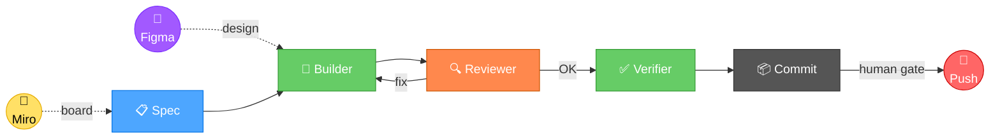
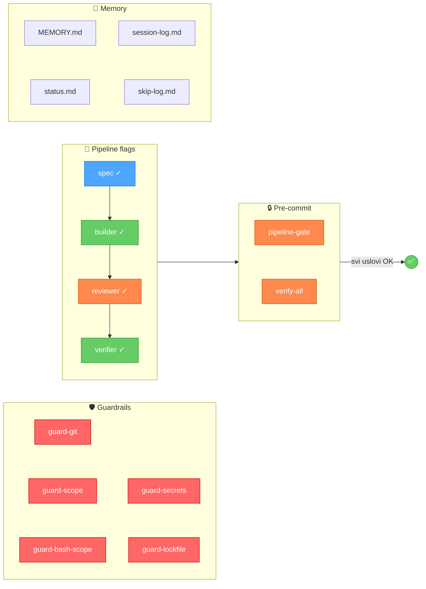

# Agent Pipeline Development (APD) Template

Softverski razvoj kroz specijalizovane agente u definisanom pipeline-u sa verifikacijama i human gate-ovima.

## Šta je APD?

APD je workflow za AI-asistiran razvoj softvera gde:
- **Agent** — rad dele specijalizovani agenti sa jasnim domenima, ne jedan generički AI
- **Pipeline** — definisan tok sa fazama, verifikacijama i gate-ovima koji se ne preskaču
- **Development** — softverski razvoj kao krajnji cilj

## Pun lanac: od ideje do koda





Svaki korak ima mašinski čitljiv izvor istine — niko ne prepisuje ručno iz jednog alata u drugi:

| Faza | Alat | Šta definiše | Ko čita |
|------|------|-------------|---------|
| Koncept | **Miro** | Flow, user journey, system arhitektura, wireframe | Orkestrator → generiše spec |
| Dizajn | **Figma** | UI komponente, tokeni, boje, layout | Builder → implementira UI |
| Implementacija | **APD pipeline** | Kod, testovi, build | Builder → Reviewer → Verifier |

Miro i Figma su opcioni — APD radi i bez njih, ali sa njima pokriva ceo put od ideje do koda.

## APD Pipeline

Svaka implementacija prolazi sve faze — bez izuzetaka. Reviewer se nikad ne preskače, čak ni za "trivijalne" promene.

Svaki korak je **tehnički zaštićen** — hook-ovi blokiraju commit ako koraci nisu završeni.

## Brzi start

### Preduslovi

- [Claude Code](https://docs.anthropic.com/en/docs/claude-code) CLI instaliran
- `jq` instaliran (`brew install jq` na macOS, `apt install jq` na Linux) — potreban za hook skripte
- Git repozitorijum inicijalizovan

### 1. Kopiraj template u svoj projekat

```bash
cp -r apd-template/.claude/ /path/to/my-project/.claude/
cp apd-template/CLAUDE.md /path/to/my-project/
cp apd-template/.mcp.json.example /path/to/my-project/.mcp.json
cp -r apd-template/docs/ /path/to/my-project/docs/
```

### 2. Pokreni APD Init

U Claude Code na svom projektu:
```
/apd-init
```

Skill će te provesti kroz konfiguraciju — ime projekta, stack, putanje, agenti.

### 3. Ili ručno prilagodi

Zameni `{{PLACEHOLDER}}` vrednosti u:
- `CLAUDE.md` — projektne instrukcije
- `.claude/settings.json` — putanje do skripti
- `.claude/scripts/session-start.sh` — ime projekta
- `.claude/scripts/verify-all.sh` — build komande
- `.claude/scripts/guard-secrets.sh` — osetljivi fajlovi
- `.claude/memory/MEMORY.md` — indeks
- `.claude/agents/TEMPLATE.md` → kopiraj za svakog agenta

### 4. Učini skripte executable

```bash
chmod +x .claude/scripts/*.sh
```

### 5. Verifikuj

```bash
# Kompletna funkcionalna verifikacija (guard testovi, pipeline end-to-end, struktura)
bash .claude/scripts/verify-apd.sh

# Očekivan rezultat:
# ╔══════════════════════════════════════╗
# ║  PASS: 49  │ FAIL: 0   │ WARN: 0       ║
# ╚══════════════════════════════════════╝
# APD JE POTPUNO KONFIGURISAN. Spreman za rad.
```

`verify-apd.sh` testira 10 kategorija:

| # | Kategorija | Šta proverava |
|---|-----------|---------------|
| 1 | Preduslovi | jq, git, git repo |
| 2 | Struktura | Direktorijumi, skripte (executable), memory fajlovi |
| 3 | Settings | Hook registracija, attribution prazna |
| 4 | Placeholder-i | Nijedan `{{...}}` ne sme ostati |
| 5 | CLAUDE.md | Obavezne sekcije (Stack, APD, Pipeline, Guardrails...) |
| 6 | Agenti | Frontmatter, model, guard-scope/git/secrets registrovani |
| 7 | Guard testovi | Funkcionalno testira svaki guard (blokira/propušta) |
| 8 | Pipeline E2E | Spec → Builder → Reviewer → Verifier → gate pass + rollback |
| 9 | verify-all.sh | Da li su build/test komande konfigurisane |
| 10 | Gitignore | .pipeline/ i settings.local.json zaštićeni |

Za brzu statičku proveru (bez funkcionalnih testova):
```bash
bash .claude/scripts/test-hooks.sh
```

## Četiri role

### Orkestrator (Claude Code — glavna sesija)
Centralni koordinator koji upravlja celim pipeline-om:
- Kreira spec karticu i deli sa korisnikom pre implementacije
- Dispatch-uje Builder agente (paralelno gde je moguće)
- Automatski pokreće Reviewer-a posle svake implementacije
- Pokreće Verifier-a pre commitovanja
- **Jedini** commituje i push-uje (koristi `APD_ORCHESTRATOR_COMMIT=1` prefix)
- **Jedini** komunicira sa korisnikom

### Builder (subagent)
Specijalizovani agenti koji implementiraju kod prema spec-u:
- Jedan agent per domen (backend, frontend, mobile...)
- Max 3-4 edit operacije po dispatch-u
- Jasno vlasništvo nad fajlovima — bez preklapanja između agenata
- **Ne sme** commitovati, push-ovati, niti menjati fajlove van svog domena
- Definisan u `.claude/agents/` sa hook-ovima koji mehanički blokiraju kršenja

### Reviewer (subagent)
Traži bagove, rizike i propuste u Builder-ovom radu:
- Pokreće se automatski posle svakog Builder-a
- Traži: regresije, edge case-ove, security rupe, cross-layer mismatch
- **Ne** predlaže stilske promene ili refactoring van scope-a

### Verifier (skripta)
Automatska verifikacija pre commit-a:
- Pokreće `verify-all.sh` (build + test)
- Automatski se pokreće kroz `guard-git.sh` hook kad orkestrator pokušava commit
- Blokira commit ako build ili testovi ne prolaze

## Spec kartica

Pre svakog taska (bez obzira na veličinu), orkestrator kreira spec karticu:

```
## [Naziv taska]
**Cilj:** Jedna rečenica.
**Effort:** max | high
**Van scope-a:** Šta NE radimo.
**Acceptance kriterijumi:** Lista uslova za "gotovo".
**Pogođeni moduli:** Fajlovi/slojevi koji se menjaju.
**Rizici:** Šta može poći po zlu.
**Rollback:** Kako vratiti ako pukne.
**Human gate:** Da li zahteva odobrenje (API promene, migracije, auth, prod data).
**ADR:** ADR-NNNN | Potreban | N/A
```

Spec se deli sa korisnikom PRE implementacije. Korisnik odobrava ili koriguje.

### Effort nivoi

| Effort | Kada | Ko |
|--------|------|----|
| **max** | Odluke koje je skupo ispraviti | Orkestrator, Reviewer, Verifier |
| **high** | Implementacija po jasnom spec-u | Builder agenti |

## Human gate

Korisnik MORA odobriti pre:
- API promene (novi endpointi, promena potpisa)
- Migracije baze (nove tabele, promene kolona)
- Auth/role logika (promene u autorizaciji)
- Deploy na staging/produkciju
- Bilo šta što utiče na produkcijske podatke

Format: orkestrator prikaže diff summary → korisnik kaže "ok" → tek onda akcija.

## Guardrail sistem

APD koristi mehaničke guardrail-e (hook skripte) koji blokiraju kršenja čak i kad agent "zaboravi" pravila.

### Skripte (12)

| Skripta | Funkcija |
|---------|----------|
| `guard-git.sh` | Blokira neovlašćen git (commit/push samo orkestrator, bez force push, bez mass staging) |
| `guard-scope.sh` | Blokira Write/Edit van agentovog scope-a |
| `guard-bash-scope.sh` | Blokira bash write van scope-a |
| `guard-secrets.sh` | Blokira pristup osetljivim fajlovima |
| `guard-lockfile.sh` | Blokira modifikaciju lock fajlova |
| `test-hooks.sh` | Brza statička provera (fajlovi, JSON, placeholder-i) |
| `verify-apd.sh` | Kompletna funkcionalna verifikacija (guard testovi, pipeline E2E, agenti) |
| `pipeline-advance.sh` | Pipeline flag sistem sa timestampovima, rollback-om i skip log-om |
| `pipeline-gate.sh` | Blokira commit bez svih 4 pipeline koraka |
| `rotate-session-log.sh` | Automatski arhivira stare session log entry-je |
| `session-start.sh` | Učitava kontekst projekta na startu sesije |
| `verify-all.sh` | Build + test + contract check pre commit-a |

### guard-git.sh — Git operacije

PreToolUse hook na svakom Bash pozivu. Blokira:

| Operacija | Razlog |
|-----------|--------|
| `git commit` bez `APD_ORCHESTRATOR_COMMIT=1` prefiksa | Samo orkestrator sme commitovati |
| `git push` bez `APD_ORCHESTRATOR_COMMIT=1` prefiksa | Samo orkestrator sme push-ovati |
| `git add .` / `git add -A` / `git add --all` / `git add -u` / `git add *` | Forsira eksplicitno dodavanje fajlova po imenu |
| `git commit -a` / `git commit --all` | Forsira eksplicitno staging pre commit-a |
| `--no-verify` | Sprečava zaobilaženje hook-ova |
| `git reset --hard`, `git clean -f`, itd. | Blokira destruktivne operacije |
| `Co-Authored-By` | Blokira AI potpise u commitima |
| `git add .claude/` bez prefiksa | Štiti workflow fajlove |

Kad blokira commit/push, ispisuje tačnu sintaksu koju orkestrator treba da koristi.

### guard-scope.sh — File scope za agente

PreToolUse hook na Write/Edit pozivima u agent definicijama. Svaki agent definiše dozvoljene putanje:

```yaml
# U agent .md fajlu:
hooks:
  PreToolUse:
    - matcher: "Write|Edit"
      hooks:
        - type: command
          command: "bash /putanja/.claude/scripts/guard-scope.sh src/ tests/"
```

Agent koji pokuša da edituje fajl van `src/` ili `tests/` dobija:
```
BLOKIRANO: Fajl apps/frontend/App.tsx je van dozvoljenog scope-a.
Dozvoljene putanje: src/ tests/
```

### guard-bash-scope.sh — Bash write operacije

Komplementira guard-scope.sh — blokira bash komande koje pišu van dozvoljenog scope-a (redirect, `tee`, `sed -i`, `cp`, `mv`).

### guard-secrets.sh — Osetljivi fajlovi

Blokira pristup i čitanje osetljivih fajlova: `.env.production`, `.pem`, `.key`, `credentials.json`, `service-account` i drugi. Prilagodljiv za svaki stack.

### guard-lockfile.sh — Lock fajlovi

Blokira direktnu modifikaciju lock fajlova (`package-lock.json`, `pnpm-lock.yaml`, `yarn.lock`, `composer.lock`, `Cargo.lock`, `go.sum` i dr.).

### verify-all.sh — Build i test verifikacija

Automatski se pokreće pre svakog commit-a (poziva ga `guard-git.sh`). Detektuje koje fajlove commitujete i pokreće relevantne provere:
- Backend promene → build + test komande
- Frontend promene → type check + test komande

**VAŽNO:** Dolazi sa zakomentarisanim primerima — mora se konfigurisati za vaš build/test sistem.

### session-start.sh — Kontekst na početku sesije

SessionStart hook koji učitava:
- Trenutni status projekta iz `memory/status.md`
- Pipeline status
- Poslednjih 20 linija iz `memory/session-log.md`
- Automatska rotacija session log-a (čuva poslednjih 10 entry-ja)

## Pipeline u praksi

```bash
# 1. Spec
bash .claude/scripts/pipeline-advance.sh spec "Implementiraj user login"

# 2. Builder implementira
# ... agent radi ...
bash .claude/scripts/pipeline-advance.sh builder

# 3. Reviewer pregleda
# ... code review ...
bash .claude/scripts/pipeline-advance.sh reviewer

# 4. Verifier (build + test)
# ... dotnet build && dotnet test ...
bash .claude/scripts/pipeline-advance.sh verifier

# 5. Commit (dozvoljen tek sada)
APD_ORCHESTRATOR_COMMIT=1 git commit -m "feat: user login"

# Pipeline se auto-resetuje i loguje u session-log.md
```

### Pipeline komande

```bash
bash .claude/scripts/pipeline-advance.sh spec "Naziv taska"
bash .claude/scripts/pipeline-advance.sh builder
bash .claude/scripts/pipeline-advance.sh reviewer
bash .claude/scripts/pipeline-advance.sh verifier
bash .claude/scripts/pipeline-advance.sh status
bash .claude/scripts/pipeline-advance.sh reset
bash .claude/scripts/pipeline-advance.sh rollback           # Vrati jedan korak nazad
bash .claude/scripts/pipeline-advance.sh stats
bash .claude/scripts/pipeline-advance.sh skip "Razlog"      # Samo za hitne hotfix-ove
```

### Skip analiza

```bash
bash .claude/scripts/pipeline-advance.sh stats
# Pipeline statistika:
#   Ukupno skip-ova: 4
#   Poslednjih 5:
#   | 2026-04-03 | Pre-existing TS greške | pre-existing-debt |
```

Ako je >30% commitova sa skip — nešto u pipeline-u treba popraviti.

## ADR (Architecture Decision Records)

Arhitekturne odluke se dokumentuju u `docs/adr/` sa punim kontekstom: zašto je odluka doneta, koje alternative su razmatrane, i koje su posledice.

### Kada kreirati ADR

- Uvođenje nove tehnologije ili biblioteke
- Promena API dizajna ili komunikacionog paterna
- Izbor između dva validna arhitekturna pristupa
- Promena auth/security strategije
- Migracija podataka ili promena šeme

### Životni ciklus

```
Predložen → Prihvaćen → [Zamenjen (novi ADR) | Povučen]
```

- `Predložen` — može se menjati dok nije prihvaćen
- `Prihvaćen` — **immutable**. Ako se odluka promeni, kreira se novi ADR koji zamenjuje starog
- Numeracija: `0001`, `0002`, ... (4 cifre sa vodećim nulama)

### Veza sa principles.md

`principles.md` kaže **šta** (pravila), ADR kaže **zašto** (kontekst odluke):

```markdown
## Kod
- Error handling: Result pattern (vidi ADR-0004)
- Arhitekturni pattern: Vertical Slice (vidi ADR-0001)
```

## Kreiranje agenata

Za svaki sloj projekta kreiraj agenta iz `TEMPLATE.md`:

```bash
cp .claude/agents/TEMPLATE.md .claude/agents/backend-builder.md
```

Zameni:
- `{{agent-name}}` → `backend-builder`
- `{{SCOPE_PATHS}}` → `src/ tests/`
- `{{PROJECT_PATH}}` → apsolutna putanja
- `{{model}}` → `sonnet` (Builder) ili `opus` (Reviewer/Guardian)

**VAŽNO:** Ako ne zameniš `{{SCOPE_PATHS}}`, guard-scope.sh će blokirati SVE Write/Edit operacije tog agenta.

### Tipični agenti po stack-u

#### .NET / C#
| Agent | Scope | Model |
|-------|-------|-------|
| backend-api | src/ tests/ | sonnet |
| database | src/Infrastructure/ | sonnet |
| backoffice | apps/backoffice/ | sonnet |
| mobile | apps/mobile/ | sonnet |
| testing | tests/ | sonnet |
| devops | docker/ .github/ | sonnet |

#### Node.js / TypeScript
| Agent | Scope | Model |
|-------|-------|-------|
| backend | server/ | sonnet |
| frontend | client/ | sonnet |
| testing | tests/ __tests__/ | sonnet |
| devops | docker/ .github/ | sonnet |

#### Java / Spring Boot
| Agent | Scope | Model |
|-------|-------|-------|
| backend-api | src/main/java/ src/test/ | sonnet |
| database | src/main/resources/db/ src/main/java/**/repository/ | sonnet |
| frontend | frontend/ | sonnet |
| mobile | mobile/ | sonnet |
| testing | src/test/ | sonnet |
| devops | docker/ .github/ | sonnet |

#### Python / Django
| Agent | Scope | Model |
|-------|-------|-------|
| backend | apps/ | sonnet |
| frontend | frontend/ templates/ static/ | sonnet |
| testing | tests/ | sonnet |
| devops | docker/ .github/ | sonnet |

#### Python / FastAPI
| Agent | Scope | Model |
|-------|-------|-------|
| backend | app/ | sonnet |
| frontend | frontend/ | sonnet |
| testing | tests/ | sonnet |
| devops | docker/ .github/ | sonnet |

#### Go
| Agent | Scope | Model |
|-------|-------|-------|
| backend | internal/ cmd/ | sonnet |
| frontend | web/ | sonnet |
| testing | internal/ cmd/ (test files) | sonnet |
| devops | docker/ .github/ deploy/ | sonnet |

#### PHP / Symfony
| Agent | Scope | Model |
|-------|-------|-------|
| symfony-builder | backend/src/ backend/tests/ | sonnet |
| frontend | web/ backoffice/ | sonnet |
| mobile | mobile/ | sonnet |
| devops | docker/ .github/ | sonnet |

### CQRS arhitektura — agenti po odgovornosti

CQRS prirodno deli kod na write (Command) i read (Query) stranu. APD enforceuje tu granicu — guard-scope mehanički sprečava da command agent dira read modele i obrnuto.

#### CQRS agenti — .NET (MediatR / Wolverine)

| Agent | Scope | Odgovornost |
|-------|-------|------------|
| command-builder | src/Commands/ src/Domain/ src/Validators/ | Command handleri, agregati, validacija |
| query-builder | src/Queries/ src/ReadModels/ | Query handleri, read modeli, projekcije |
| event-builder | src/Events/ src/Projections/ src/Subscribers/ | Event handleri, projekcije, denormalizacija |
| infra-builder | src/Infrastructure/ src/Persistence/ | EventStore, MessageBus, repozitorijumi |
| testing | tests/ | Unit + integration testovi |

#### CQRS agenti — Java (Axon Framework / Spring)

| Agent | Scope | Odgovornost |
|-------|-------|------------|
| command-builder | src/main/java/**/command/ src/main/java/**/aggregate/ | Command handleri, agregati |
| query-builder | src/main/java/**/query/ src/main/java/**/projection/ | Query handleri, projekcije |
| event-builder | src/main/java/**/event/ src/main/java/**/saga/ | Event handleri, sage |
| infra-builder | src/main/java/**/config/ src/main/resources/ | Axon konfiguracija, persistence |
| testing | src/test/ | Testovi |

#### CQRS agenti — Node.js (NestJS CQRS)

| Agent | Scope | Odgovornost |
|-------|-------|------------|
| command-builder | src/commands/ src/domain/ src/validators/ | Command handleri, agregati |
| query-builder | src/queries/ src/read-models/ | Query handleri, read modeli |
| event-builder | src/events/ src/sagas/ | Event handleri, sage |
| infra-builder | src/infrastructure/ src/config/ | EventStore, konfiguracija |
| testing | test/ | Testovi |

#### Spec kartica za CQRS — Command

```
## [CreateOrder Command]
**Tip:** Command
**Cilj:** Kreiranje narudžbine sa validacijom dostupnosti artikala.
**Handler:** OrderCommandHandler
**Agregat:** OrderAggregate
**Validacija:** OrderValidator — artikli postoje, količina > 0, korisnik aktivan.
**Emitovani eventi:** OrderCreated, InventoryReserved
**Pogođene projekcije:** OrderSummaryView, InventoryView
**Van scope-a:** Query strana — ne menjamo read modele direktno.
**Rollback:** Kompenzacioni event OrderCancelled ako InventoryReserved failuje.
```

#### Spec kartica za CQRS — Query

```
## [GetOrderSummary Query]
**Tip:** Query
**Cilj:** Prikaz sumarnog pregleda narudžbine iz denormalizovanog read modela.
**Handler:** OrderQueryHandler
**Read model:** OrderSummaryView
**Zavisi od evenata:** OrderCreated, OrderStatusChanged, OrderItemAdded
**Van scope-a:** Command strana — ne menjamo agregate.
**Rizik:** Read model nije ažuran ako projekcija kasni (eventual consistency).
```

#### CQRS cross-layer contract verifikacija

Standardna cross-layer verifikacija (backend ↔ frontend) za CQRS projekte dobija dodatne provere:

| Contract | Izvor istine | Verifikacija |
|----------|-------------|-------------|
| Command → Event | Event klasa | Svaki command handler mora emitovati deklarisane evente |
| Event → Projection | Event klasa | Projekcija mora handlovati SVE evente koje konzumira |
| Query → Read Model | Read Model klasa | Query response mora odgovarati read model strukturi |
| Read Model → Frontend | Read Model klasa | Frontend tip mora biti 1:1 sa read modelom |

**Ključno pravilo:** Nikada ne kreiraj frontend tip iz specifikacije ili Figma dizajna — uvek čitaj read model iz koda. Read model je jedini izvor istine za query stranu.

## Session memory

Posle svakog završenog taska, orkestrator append-uje zapis u `memory/session-log.md`:

```markdown
## [YYYY-MM-DD] [Naziv taska]
**Status:** Završen | Delimičan | Blokiran
**Šta je urađeno:** [1-2 rečenice]
**Problemi:** [Šta je pošlo po zlu, ili "Bez problema"]
**Guardrail koji je pomogao:** [Koji mehanizam je uhvatio problem, ili "N/A"]
**Novo pravilo:** [Šta dodajemo u workflow, ili "Nema"]
```

Ako je novo pravilo identifikovano, orkestrator ga odmah dodaje u relevantni rules fajl. Greške postaju guardrail-i.

Pipeline reset automatski dodaje skeleton entry u session-log — orkestrator popunjava detalje.

### Memory fajlovi

- `memory/MEMORY.md` — indeks projektne memorije (uvek se učitava, minimalan kontekst)
- `memory/session-log.md` — append-only log završenih taskova (sa automatskom rotacijom)
- `memory/status.md` — trenutni status projekta (faza, fokus, blokeri)
- `memory/pipeline-skip-log.md` — skip metrika za analizu

## Cross-layer verifikacija

Kad task uključuje backend + frontend/mobile:

1. Backend DTO/response model je **izvor istine**
2. Za svako polje, mapirati tip na frontend/mobile ekvivalent
3. Nullable polja moraju biti nullable na svim slojevima
4. Datumi: uvek ISO 8601 string na frontend/mobile strani
5. **NIKADA** ne kreirati frontend/mobile tip iz specifikacije — uvek čitaj backend DTO

Dodaj tabelu mapiranja tipova za svoj stack u `workflow.md`.

## Figma integracija (opciono)

Ako projekat ima Figma dizajn, APD ga integriše u workflow:

1. **`/apd-init`** pita za Figma URL i konfiguriše `CLAUDE.md`
2. **CLAUDE.md** sadrži Figma sekciju sa linkom i pravilima
3. **Frontend Builder** koristi Figma MCP (`get_design_context`, `get_screenshot`) za dizajn kontekst
4. **Skill-ovi** za Figma workflow:

| Skill | Kada |
|-------|------|
| `figma:figma-implement-design` | Implementacija UI iz Figma dizajna |
| `figma:figma-generate-design` | Kreiranje dizajna u Figma iz koda |
| `figma:figma-generate-library` | Design system / token library |
| `figma:figma-code-connect` | Mapiranje Figma komponenti na kod |
| `figma:figma-create-design-system-rules` | Generisanje design system pravila |

**Pravila kad postoji Figma dizajn:**
- Pre implementacije UI komponente — uvek proveri Figma dizajn
- Dizajn tokeni i boje iz Figma-e su izvor istine
- Ne izmišljaj vrednosti — koristi `get_design_context`
- Ako nema Figma dizajna — obriši Figma sekciju iz `CLAUDE.md`

## Miro integracija (opciono)

Ako projekat koristi Miro za specifikacije, arhitekturu ili planiranje, APD ga integriše u workflow.

### Setup

```bash
claude mcp add --transport http miro https://mcp.miro.com
```

Posle toga: `/mcp auth` za OAuth autentifikaciju sa Miro nalogom.

Alternativno, instaliraj Miro skill-ove:
```bash
npx skills add miroapp/miro-ai
```

### Mogućnosti

| Akcija | Opis |
|--------|------|
| Čitaj board | Structured summary — sticky notes, frames, dijagrami, dokumenti |
| Kreiraj dijagram | Iz tekst opisa, auto-detect tip (flowchart, sequence, ER...) |
| Kreiraj dokument | Markdown dokument na boardu |
| Kreiraj tabelu | Sa tipovanim kolonama |
| Explore board | Listaj item-e po frameovima i tipovima |

### Kako se uklapa u APD pipeline

| APD faza | Miro uloga |
|----------|------------|
| **Pre spec-a** | Orkestrator čita Miro board → generiše spec karticu iz sticky notes/frameova |
| **Spec** | Wireframe-ovi i flow dijagrami sa boarda kao input za spec |
| **Arhitektura** | System dijagram na boardu — živi dokument koji se ažurira |
| **Review** | Vizuelizacija realizovane arhitekture posle implementacije |
| **Planiranje** | Task board sa sticky notes → orkestrator parsira u pipeline taskove |

**Pravila kad postoji Miro board:**
- Pre kreiranja spec kartice — proveri da li postoji relevantan sadržaj na boardu
- Miro board je izvor istine za procese i arhitekturu
- Orkestrator može kreirati dijagrame na boardu za dokumentaciju
- Ako nema Miro boarda — obriši Miro sekciju iz `CLAUDE.md`

## Memorija — dva sistema

| | APD memorija (`.claude/memory/`) | Claude auto memorija (`~/.claude/projects/`) |
|---|---|---|
| **Šta čuva** | Projektno znanje — status, session log, naučene lekcije | Lične preference korisnika |
| **Ko koristi** | Svi na projektu (orkestrator + agenti) | Samo taj korisnik na toj mašini |
| **Gde živi** | U repozitorijumu — commituje se | Lokalno — NE commituje se |
| **Primer** | "Auth middleware mora koristiti Redis sessione" | "Korisnik preferira kratke odgovore" |

## Rules vs Skills

| | Rules (`.claude/rules/`) | Skills (`.claude/skills/`) |
|---|---|---|
| **Učitavanje** | Uvek, automatski za sve agente | Eksplicitno, kad agent treba konvencije |
| **Sadržaj** | Globalna pravila i workflow | Convention snippet-ovi i procedure |
| **Primer** | `workflow.md` — APD pipeline definicija | Naming konvencije za API endpointe |

## settings.json — Hook konfiguracija

Definiše automatsko ponašanje Claude Code sesije:

| Hook | Skripta | Šta radi |
|------|---------|----------|
| `SessionStart` | `session-start.sh` | Učitava projektni kontekst (status, pipeline, poslednja sesija) |
| `PreToolUse (Bash)` | `guard-git.sh` | Blokira neovlašćene git operacije |
| `PreToolUse (Write\|Edit)` | `guard-lockfile.sh` | Blokira modifikaciju lock fajlova |
| `Notification` | — | Desktop notifikacija kad Claude treba pažnju |

Ostala podešavanja:

- `CLAUDE_CODE_EXPERIMENTAL_AGENT_TEAMS: "1"` — omogućava agent teams
- `attribution.commit: ""` i `attribution.pr: ""` — prazno, nema AI potpisa u commitima

**Napomena:** `guard-scope.sh`, `guard-bash-scope.sh` i `guard-secrets.sh` se NE stavljaju u `settings.json` (globalni) već samo u individualne agent `.md` fajlove — jer orkestrator mora imati pristup svim fajlovima.

## Struktura

```
.claude/
├── agents/
│   └── TEMPLATE.md                  # Šablon za novog agenta
├── rules/
│   ├── workflow.md                  # APD workflow definicija (UNIVERZALNO)
│   └── principles.md               # Projektna pravila (PRILAGODITI)
├── skills/
│   └── apd-init/SKILL.md           # Interaktivni setup skill
├── scripts/
│   ├── guard-git.sh                 # Git guardrail (UNIVERZALNO)
│   ├── guard-scope.sh               # File scope guardrail (UNIVERZALNO)
│   ├── guard-bash-scope.sh          # Bash write scope guardrail (UNIVERZALNO)
│   ├── guard-secrets.sh             # Secrets guardrail (PRILAGODITI)
│   ├── guard-lockfile.sh            # Lock file guardrail (UNIVERZALNO)
│   ├── pipeline-advance.sh          # Pipeline flag sistem
│   ├── pipeline-gate.sh             # Pipeline commit gate
│   ├── test-hooks.sh                # Hook verifikacija
│   ├── verify-all.sh                # Build + test verifikacija (PRILAGODITI)
│   ├── session-start.sh             # Učitava kontekst na početku sesije
│   └── rotate-session-log.sh        # Log rotacija
├── memory/
│   ├── MEMORY.md                    # Indeks memorije
│   ├── session-log.md               # Append-only log završenih taskova
│   ├── status.md                    # Trenutni status projekta
│   └── pipeline-skip-log.md         # Skip metrika
└── settings.json                    # Hook konfiguracija

CLAUDE.md                            # Projektne instrukcije (PRILAGODITI)
.mcp.json.example                    # MCP serveri (context7, postgres, docker, github)
docs/
└── adr/                             # Architecture Decision Records
    ├── TEMPLATE.md                  # Šablon za ADR
    └── README.md                    # Indeks svih ADR-ova
```

## Šta prilagoditi

| Fajl | Šta | Prioritet |
|------|-----|-----------|
| `CLAUDE.md` | Stack, konvencije, struktura projekta, naziv | **Obavezno** |
| `verify-all.sh` | Build i test komande za svoj stack | **Obavezno** |
| `principles.md` | Jezik, error handling, arhitekturni pattern | **Obavezno** |
| `guard-secrets.sh` | Osetljivi fajlovi za svoj stack | Preporučeno |
| `agents/TEMPLATE.md` | Kreirati konkretne agente za svoje domene | Preporučeno |
| `settings.json` | Automatski konfiguriše `/apd-init` | Automatski |
| `docs/adr/TEMPLATE.md` | Prilagoditi format ADR-a ako treba | Opciono |

### CLAUDE.md — šta popuniti

CLAUDE.md je najvažniji fajl — jedini koji je **uvek** u Claude Code kontekstu (nikad se ne kompresuje). Sadrži:

- **O projektu** — kratak opis, ciljna baza korisnika — **POPUNITI**
- **Tehnički stack** — backend, frontend, infrastruktura — **POPUNITI**
- **APD Hard Rules** — kritična pravila koja preživljavaju context kompresiju. **NE MENJATI** — ova sekcija je univerzalna i dolazi pre-popunjena
- **Pravila** — jezik, git konvencije — **POPUNITI**

### verify-all.sh — kako konfigurisati

Dolazi zakomentarisan. Otkomentariši i podesi za svoj stack:

```bash
# Node.js:  npm test
# Python:   pytest tests/
# Go:       go build ./... && go test ./...
# .NET:     dotnet build && dotnet test
```

Skripta automatski detektuje koje fajlove commitujete i pokreće samo relevantne provere.

## Dodavanje projektno-specifičnih pravila

Kreiraj nove fajlove u `.claude/rules/`:
- `code-style.md` — naming, formatting konvencije
- `api-design.md` — REST/GraphQL konvencije
- `database.md` — šema, migracije, naming
- `security.md` — auth, validacija, secrets
- `logging.md` — log format, nivoi, šta ne logovati

## Preporučeni plugini

APD template je dizajniran da radi sa [Superpowers](https://github.com/anthropics/claude-code-plugins) pluginom za Claude Code:

| Faza | Plugin/Skill | Opis |
|------|-------------|------|
| Pre implementacije | `superpowers:brainstorming` | Istražuje nameru, zahteve, dizajn |
| Pre implementacije | `superpowers:writing-plans` | Kreira implementacioni plan iz spec-a |
| Builder | `superpowers:subagent-driven-development` | Paralelni agenti za nezavisne taskove |
| Builder | `superpowers:test-driven-development` | TDD workflow |
| Builder | `superpowers:systematic-debugging` | Sistematski debugging pre fix-a |
| Reviewer | `superpowers:requesting-code-review` | Review po završetku implementacije |
| Reviewer | `simplify` | Review za kvalitet i efikasnost |
| Verifier | `superpowers:verification-before-completion` | Verifikacija pre tvrdnje da je gotovo |
| Post-commit | `superpowers:finishing-a-development-branch` | Merge, PR, cleanup opcije |

## Principi

1. **Spec pre koda** — svaki task počinje mini-spec karticom koju korisnik odobri
2. **Tri role** — Builder (implementira) → Reviewer (nalazi bagove) → Verifier (potvrđuje)
3. **Mikro-zadaci** — max 3-4 edit operacije po agentu, jasno vlasništvo nad fajlovima
4. **Human gate** — čovek odobrava API promene, migracije, auth logiku, deploy
5. **Cross-layer verifikacija** — frontend/mobile tipovi moraju biti 1:1 sa backend DTO-ovima
6. **Greškom-vođeni guardrail-i** — svaka greška postaje novo pravilo u memoriji
7. **Session memory** — posle svakog taska: šta je urađeno, šta je pošlo po zlu, nova pravila
8. **ADR za arhitekturu** — arhitekturne odluke se dokumentuju sa kontekstom, alternativama i posledicama

## Licenca

MIT
