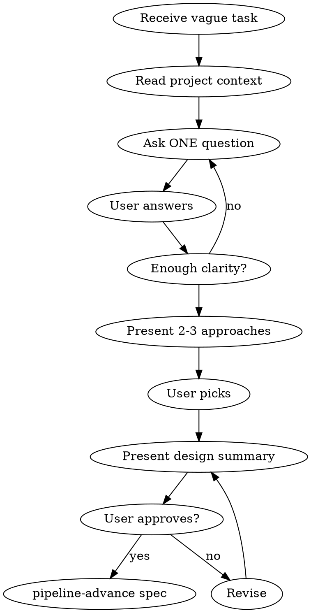

# APD Brainstorm

## The Iron Law

```
NO SPEC WITHOUT SHARED UNDERSTANDING FIRST
```

If you cannot explain the design in one sentence — you are not ready for a spec.

## When to use / When to skip

**Use when:**
- The task is vague, broad, or "improve X" style
- The user gave a destination but no path ("we need user search")
- Multiple reasonable interpretations exist
- You catch yourself making implementation choices the user hasn't seen

**Default: load on every new task.** v6.8.11 made the brainstorm-marker gate unconditional — the previous "trivial task (≤2 R-criteria) automatic skip" carve-out is gone. R-count proved gameable: orchestrator atomized non-trivial work to 2 R-criteria specifically to bypass the gate, producing 30-40 min pipelines with downstream BLOCK cascades. Per-task brainstorm load is structurally cheaper than the BLOCK loop that an undisciplined entry triggers.

**Skip only when (TWO-PART CHECK — both must be true):**

1. **Scope is already aligned** — task is fully specified (file paths, function names, R-criteria) OR user has approved a design informally, AND
2. **APD config decisions are explicit** — you can answer YES to ALL:
   - Adversarial budget: will omit the field (default = unlimited) — `max_defects` is deprecated (v6.9); use `pipeline_mode: polish` for hotfix/polish, not a budget cap
   - Plan format: will write `**Implements:** R<N>` (or `none`) on **EVERY** `### Section` — including Agents, Notes, Files-to-modify, Files-to-create (NO RESERVED NAMES)
   - Rationale format: after adversarial dispatch, will write `.apd/pipeline/.adversarial-rationale.md` (note the `.md` extension!) with per-finding `## Finding N` + `**Severity:**` + `**Status:**` + `**Rationale:**` (≥40 chars for dismissed)
   - BLOCK recovery: you know how to recover from a plan-spec-consistency / rationale-missing / rationale-100pct-dismiss BLOCK

Canonical skip cases: genuine 1:1 mirror of a just-completed task (same scope shape, same agents, same config), single-line bug fix with one R-criterion, or hotfix with explicit pre-aligned design.

**Also skip when:**
- You are mid-pipeline (spec is locked; raise concerns to user, don't re-brainstorm)

**If you cannot confirm BOTH parts (scope + config) — DO NOT skip.** Load the skill. Empirical evidence: Bambi Cycle E (2026-05-22) informal brainstorm covered scope but NOT APD config → 3h cascade. BambiProject MS.4 + Photo Bill CTA (2026-05-23) skipped via R-atomization → 30-40 min each with adversarial N/A.

If you do skip, the override flag requires explicit reason that acknowledges both parts:
```bash
bash .claude/bin/apd pipeline spec "Task" --skip-brainstorm "<reason mentioning scope alignment AND APD config clarity>"
```

## Process



### 1. Read Context

- CLAUDE.md — stack, architecture
- Recent session-log — what was done before
- Existing code related to the idea

### 2. Ask One Question at a Time

**Do NOT dump a list of questions.** Ask one, wait, ask next.

Good: `What problem does this solve for the user?`

Bad:
```
1. What problem does this solve?
2. Who is the target user?
3. What's the priority?
...
```

### 3. Explore Trade-offs

When there are choices, present 2-3 options concisely:

```
Two approaches:
A) Server-rendered — simpler, faster initial load, no JS complexity
B) AJAX — smoother UX, no page reload, more JS code

Which fits better?
```

### 4. Converge on Design

When enough is clear:

```
Goal: [one sentence]
Scope: [what's included]
Out of scope: [what's not]
Approach: [technical approach]
Affected files: [list]
Risks: [concrete risks with mitigation — at least 1; especially for migration/security/auth tasks]
Rollback: [revert plan — revert commit + optional manual SQL/DROP if migration]
Mode: [Full | Lean]
Adversarial budget: [omit field for default unlimited | =0/=N power-user override]
R-criteria: [N items, listed R1, R2, ...]
Human gate: [YES/NO]

Ready to write the spec-card.md?
```

**Risks + Rollback are NOT optional fields** for tasks involving:
- Database migration (ALTER/CREATE/DROP)
- New public endpoint (security surface)
- Auth/role/permission changes
- External API integration

For trivial polish/hotfix tasks (1-2 R, no DB, no new endpoint), Risks can be "minimal — see Out of scope" and Rollback can be "revert commit". Be explicit anyway — empty Risks/Rollback in spec-card.md is a documentation gap that adversarial reviewer cannot catch.

**Adversarial budget — `max_defects` field is DEPRECATED as of v6.9, removed in v7.0.**

**DO NOT write `adversarial: max_defects=...` in new specs.** Field continues to function in v6.9 for graceful transition (verifier gate + immutability check both active), but emits a deprecation warn on every spec advance + INFO entry to guard-audit.log. Rationale gate (v6.7) structurally covers the misuse pattern that max_defects was meant to prevent.

| Task profile | Recommended |
|---|---|
| Standard task (1–7 R, almost all) | **omit `max_defects` field** — default = unlimited |
| polish-mode (1–2 R hotfix) | `pipeline_mode: polish` — lower cycle caps + skip adversarial entirely |

Empirical evidence (v6.8 dev cycle, 2026-05-22):
- "Add contact form" (max_defects=0, 6 R): 33 min, 3 guard BLOCK cascade (max_defects-exceeded + raise-attempt + cycle-cap), 2 reset cycles.
- "Rate limit kontakt forme" (max_defects=0, 5 R): 26 min, T=8:A=8:D=0 (forced accept all 8 findings), 3 BLOCKs.
- "Admin lista" (NO max_defects field, 6 R): 13 min, T=10:A=1:D=9 (real adversarial work), clean run.

v6.8 chain (10 patches) validated rationale gate (v6.7) as sufficient standalone enforcement — max_defects became redundant. Rationale gate hard-blocks 100%-orchestrator-dismiss pattern (T≥3 && A==0 && Do≥1) + requires per-finding rationale ≥40 chars for dismissed findings, without forcing accept-everything cascade.

### 4b. Downstream gates the spec triggers

After spec advance, orchestrator MUST write these files. Brainstorm should mentally prepare for them:

**Implementation plan format** (writes to `.apd/pipeline/implementation-plan.md`):

```
## Implementation Plan: <task-name>

### Files to modify
**Implements:** none              ← scaffolding sections use 'none'

- src/...

### Files to create
**Implements:** none              ← scaffolding sections use 'none'

- ...

### Backend
**Implements:** R1, R3            ← every dispatch section maps to R-ids

- src/api/... — endpoint changes

### Agents
**Implements:** none              ← NO RESERVED NAMES — Agents needs **Implements:** too

- backend-builder
- code-reviewer

### Notes
**Implements:** none              ← NO RESERVED NAMES — Notes needs **Implements:** too

- relevant context
```

**EVERY `### Section` MUST have `**Implements:**` header — NO EXCEPTIONS.** The rule is uniform across:
- Functional sections (Backend, Frontend, Database, Tests) → use R-id list (`R1, R3`)
- Scaffolding sections (Files to modify, Files to create, Agents, Notes, etc.) → use `none`

**Common mistake (empirical evidence from the v6.8 dev cycle):** the orchestrator generalizes "Implements" from the format example for Files to modify/Files to create but forgets it for Agents/Notes — asymmetric learning. The Soft-delete task (2026-05-22) triggered a plan-spec-consistency BLOCK on 2 missing headers (Agents + Notes) even though the other sections were mapped correctly. **`verify-plan-spec` strict mode hard-BLOCKS `apd pipeline builder` on any `### Section` without a header** — v6.8.1+ default.

Bidirectional check: every R-id from spec must appear in ≥1 section's **Implements:** line; every section must declare R-ids or `none`.

**Adversarial rationale format** (writes to `.apd/pipeline/.adversarial-rationale.md` AFTER adversarial-reviewer dispatch, BEFORE `apd pipeline verifier`):

```
## Finding 1 — <one-line title>
**Severity:** critical | important | minor
**Status:** accepted | dismissed | reviewer-self-dismissed
**Rationale:** <text ≥40 chars required for dismissed/reviewer-self-dismissed>
```

Skipping this file → v7.1 BLOCK at verifier. Plus rationale gate hard-blocks the 100%-orchestrator-dismiss pattern (T≥3 && A==0 && Do≥1) — at least one finding must be accepted OR reclassified to reviewer-self-dismissed.

### 4c. Common BLOCKs + recovery

| BLOCK reason | Likely cause | Quick fix |
|---|---|---|
| `plan-spec-consistency issues=N mode=strict` | Plan section missing `**Implements:**` header OR spec R-id unreferenced | Read the inline BLOCK template; add headers/R-ids per section; re-run `apd pipeline builder` (~10s recovery) |
| `max_defects-exceeded` (v6.9 DEPRECATED) | Adversarial returns >budget findings | Reset + remove `max_defects` field from spec-card. Gate goes away entirely in v7.0; rationale gate is the replacement. |
| `max_defects-raised-mid-pipeline` (v6.9 DEPRECATED) | Tried to raise budget after spec.done | v6.3 D immutability check. Migration path: reset + remove field; do not re-introduce. |
| `rationale-missing` | Forgot `.adversarial-rationale.md` before verifier | Write file with T entries (Finding/Severity/Status/Rationale), re-run verifier. |
| `rationale-100pct-orch-dismiss` | All findings dismissed (T≥3, A=0, Do≥1) | Accept at least one finding OR reclassify dismissed → reviewer-self-dismissed with adversarial reviewer's inline Note as Rationale. |
| `max_builder_cycles-exceeded` | Hit `.builder-count` cap (default 2) | Either accept smaller scope (lower expectations), reset + decompose into 2+ tasks, OR raise cap via spec-card `builder: max_cycles=N`. |
| `adversarial-before-reviewer` | Tried to dispatch adversarial-reviewer before reviewer.done | Dispatch code-reviewer first; advance reviewer; THEN adversarial. |

### 5. Hand Off to Spec

Do not advance the pipeline while asking questions, presenting options, or
revising the design. Once the user explicitly approves the design summary,
write spec-card.md and enter the pipeline; that advance is the only valid exit
from brainstorming.

**MANDATORY (v6.8.5+):** before calling `apd pipeline spec`, write the
brainstorm marker so the spec gate knows this task was brainstormed:

```bash
# Inside .apd/pipeline/ — single line: <task-name>|<ISO-8601 timestamp>
printf '%s|%s\n' "Feature name" "$(date -u +%Y-%m-%dT%H:%M:%SZ)" > .apd/pipeline/.brainstorm-marker

# Then advance:
bash .claude/bin/apd pipeline spec "Feature name"
```

`pipeline-advance spec` reads the marker. If R-count in spec-card.md is > 2
(non-trivial task) and the marker is missing OR the task name doesn't match,
the spec gate hard-BLOCKS with instruction to load `/apd-brainstorm` first.

**Override (v6.8.8+ — rare, requires concrete reason argument):** pass
`--skip-brainstorm "<reason>"` to `apd pipeline spec`. Reason MUST acknowledge
BOTH scope alignment AND APD config clarity (plan `**Implements:**` format +
rationale `.md` format; adversarial budget is always the default — no field).
Empty reason → BLOCK. Example:
```bash
bash .claude/bin/apd pipeline spec "Task" --skip-brainstorm "Pre-aligned scope (1:1 mirror of prior task) + plan Implements headers on every section + rationale format clear"
```
The skip event with its reason is logged to guard-audit.log as an INFO entry for the audit trail.

<HARD-GATE>
Do NOT write code during brainstorming. Do NOT advance the pipeline mid-flow
while questions or design choices are still open. This skill produces a
DESIGN, then exits only by advancing the approved spec. Code comes from
Builder agents after the spec is approved.
</HARD-GATE>

## Red Flags — STOP

| Thought | Reality |
|---------|---------|
| "This is simple enough, skip brainstorm" | Simple tasks have hidden complexity. 5 minutes of questions saves 30 minutes of rework. |
| "I already know what they want" | You know what YOU would build. Ask what THEY want. |
| "Let me just start coding and iterate" | Iteration without direction is waste. Design first. |
| "The user seems impatient" | Users are more impatient when you build the wrong thing. |
| "I'll figure it out during implementation" | Builder agents follow specs. Vague specs produce vague code. |

## Rules

- One question at a time
- Listen more than propose
- Present trade-offs, don't decide for the user
- No code during brainstorming
- No pipeline advance while asking questions, presenting options, or revising the design
- End with a clear design that feeds into the spec

## Exit criteria

You're done when:
- The user can restate the goal in one sentence and you both agree on it
- Scope and out-of-scope are explicit and written down
- Approach is named (architectural pattern, library choice, integration point)
- Affected files are listed (not just "wherever it goes")
- The user has explicitly approved the design summary — no implicit approval
- The spec-card.md has been written and `pipeline-advance spec "<name>"` has been called as the final brainstorm action

## Hand-off

- After explicit approval → write the spec-card.md and call `pipeline-advance spec "<name>"`; this is not a mid-brainstorm advance, it is the only valid exit
- Never leads to: code, agents, implementation — those come from the builder phase
- If the user asks for "just one quick thing" mid-brainstorm → finish the brainstorm first, then queue it
