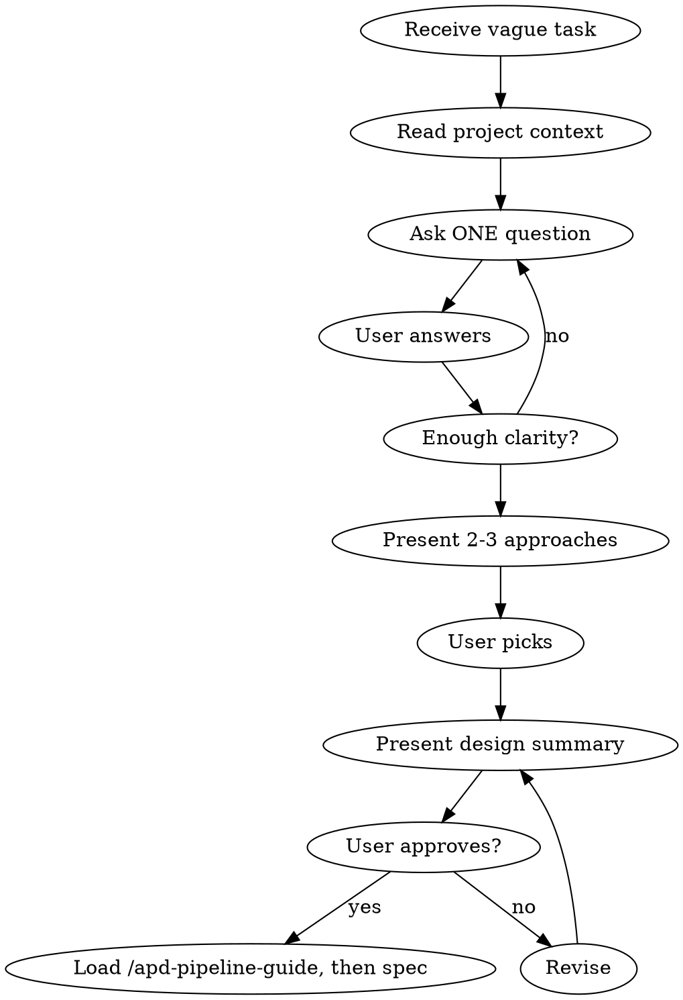

# APD Brainstorm

## The Iron Law

```
NO SPEC WITHOUT SHARED UNDERSTANDING FIRST
```

If you cannot explain the design in one sentence — you are not ready for a spec.

## When to use / When to skip

**Use when:**
- The task is vague, broad, or "improve X" style
- The user gave a destination but no path ("we need user search")
- Multiple reasonable interpretations exist
- You catch yourself making implementation choices the user hasn't seen

**Skip when:**
- The task is fully specified (file paths, function names, R-criteria) or the
  user has already approved a design informally — a genuine 1:1 mirror of a
  just-completed task, a single-line bug fix, a hotfix with pre-aligned design
- You are mid-pipeline (spec is locked; raise concerns to user, don't re-brainstorm)

Skipping this skill does NOT skip the pipeline contract: `/apd-pipeline-guide`
is mandatory on every task regardless, and the spec gate enforces its marker.
This skill answers "WHAT are we building?"; the guide answers "HOW does the
pipeline run?". Only the first question is ever optional.

## Process



### 1. Read Context

- CLAUDE.md — stack, architecture
- Recent session-log — what was done before
- Existing code related to the idea

### 2. Ask One Question at a Time

**Do NOT dump a list of questions.** Ask one, wait, ask next.

Good: `What problem does this solve for the user?`

Bad:
```
1. What problem does this solve?
2. Who is the target user?
3. What's the priority?
...
```

### 3. Explore Trade-offs

When there are choices, present 2-3 options concisely:

```
Two approaches:
A) Server-rendered — simpler, faster initial load, no JS complexity
B) AJAX — smoother UX, no page reload, more JS code

Which fits better?
```

### 4. Converge on Design

When enough is clear:

```
Goal: [one sentence]
Scope: [what's included]
Out of scope: [what's not]
Approach: [technical approach]
Affected files: [list]
Risks: [concrete risks with mitigation — at least 1; especially for migration/security/auth tasks]
Rollback: [revert plan — revert commit + optional manual SQL/DROP if migration]
Mode: [Full | Lean]
R-criteria: [N items, listed R1, R2, ...]
Human gate: [YES/NO]

Ready to write the spec-card.md?
```

**Risks + Rollback are NOT optional fields** for tasks involving:
- Database migration (ALTER/CREATE/DROP)
- New public endpoint (security surface)
- Auth/role/permission changes
- External API integration

For trivial polish/hotfix tasks (1-2 R, no DB, no new endpoint), Risks can be "minimal — see Out of scope" and Rollback can be "revert commit". Be explicit anyway — empty Risks/Rollback in spec-card.md is a documentation gap that adversarial reviewer cannot catch.

### 5. Hand Off

Do not advance the pipeline while asking questions, presenting options, or
revising the design. Once the user explicitly approves the design summary:

1. Load `/apd-pipeline-guide` — the mandatory pipeline operating manual. It
   carries the gate contract (plan format, rationale format, BLOCK recovery)
   and writes the `.guide-marker` the spec gate requires.
2. Write spec-card.md and call `apd pipeline spec "<name>"` — the only valid
   exit from brainstorming.

<HARD-GATE>
Do NOT write code during brainstorming. Do NOT advance the pipeline mid-flow
while questions or design choices are still open. This skill produces a
DESIGN, then exits only by advancing the approved spec. Code comes from
Builder agents after the spec is approved.
</HARD-GATE>

## Red Flags — STOP

| Thought | Reality |
|---------|---------|
| "This is simple enough, skip brainstorm" | Simple tasks have hidden complexity. 5 minutes of questions saves 30 minutes of rework. |
| "I already know what they want" | You know what YOU would build. Ask what THEY want. |
| "Let me just start coding and iterate" | Iteration without direction is waste. Design first. |
| "The user seems impatient" | Users are more impatient when you build the wrong thing. |
| "I'll figure it out during implementation" | Builder agents follow specs. Vague specs produce vague code. |

## Rules

- One question at a time
- Listen more than propose
- Present trade-offs, don't decide for the user
- No code during brainstorming
- No pipeline advance while asking questions, presenting options, or revising the design
- End with a clear design that feeds into the spec

## Exit criteria

You're done when:
- The user can restate the goal in one sentence and you both agree on it
- Scope and out-of-scope are explicit and written down
- Approach is named (architectural pattern, library choice, integration point)
- Affected files are listed (not just "wherever it goes")
- The user has explicitly approved the design summary — no implicit approval
- `/apd-pipeline-guide` has been loaded, the spec-card.md has been written and `pipeline-advance spec "<name>"` has been called as the final brainstorm action

## Hand-off

- After explicit approval → load `/apd-pipeline-guide`, write the spec-card.md and call `pipeline-advance spec "<name>"`; this is not a mid-brainstorm advance, it is the only valid exit
- Never leads to: code, agents, implementation — those come from the builder phase
- If the user asks for "just one quick thing" mid-brainstorm → finish the brainstorm first, then queue it
