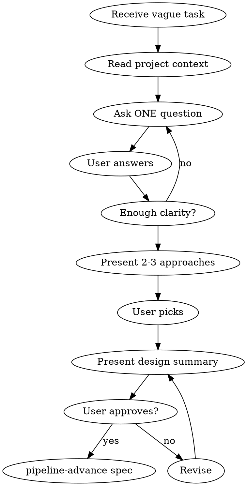

# APD Brainstorm

## The Iron Law

```
NO SPEC WITHOUT SHARED UNDERSTANDING FIRST
```

If you cannot explain the design in one sentence — you are not ready for a spec.

## Process



### 1. Read Context

- CLAUDE.md — stack, architecture
- Recent session-log — what was done before
- Existing code related to the idea

### 2. Ask One Question at a Time

**Do NOT dump a list of questions.** Ask one, wait, ask next.

Good: `What problem does this solve for the user?`

Bad:
```
1. What problem does this solve?
2. Who is the target user?
3. What's the priority?
...
```

### 3. Explore Trade-offs

When there are choices, present 2-3 options concisely:

```
Two approaches:
A) Server-rendered — simpler, faster initial load, no JS complexity
B) AJAX — smoother UX, no page reload, more JS code

Which fits better?
```

### 4. Converge on Design

When enough is clear:

```
Goal: [one sentence]
Scope: [what's included]
Out of scope: [what's not]
Approach: [technical approach]
Affected files: [list]

Ready to write the spec card?
```

### 5. Hand Off to Spec

Once user approves → write spec card and enter pipeline:

```bash
bash .claude/bin/apd pipeline spec "Feature name"
```

<HARD-GATE>
Do NOT write code during brainstorming. This skill produces a DESIGN, not an implementation. Code comes from Builder agents after the spec is approved.
</HARD-GATE>

## Red Flags — STOP

| Thought | Reality |
|---------|---------|
| "This is simple enough, skip brainstorm" | Simple tasks have hidden complexity. 5 minutes of questions saves 30 minutes of rework. |
| "I already know what they want" | You know what YOU would build. Ask what THEY want. |
| "Let me just start coding and iterate" | Iteration without direction is waste. Design first. |
| "The user seems impatient" | Users are more impatient when you build the wrong thing. |
| "I'll figure it out during implementation" | Builder agents follow specs. Vague specs produce vague code. |

## Rules

- One question at a time
- Listen more than propose
- Present trade-offs, don't decide for the user
- No code during brainstorming
- End with a clear design that feeds into the spec

## Integration

- **Called by:** Orchestrator, when task is vague or complex (workflow.md step 1)
- **Leads to:** `pipeline-advance spec` (the only valid exit)
- **Never leads to:** code, agents, implementation
