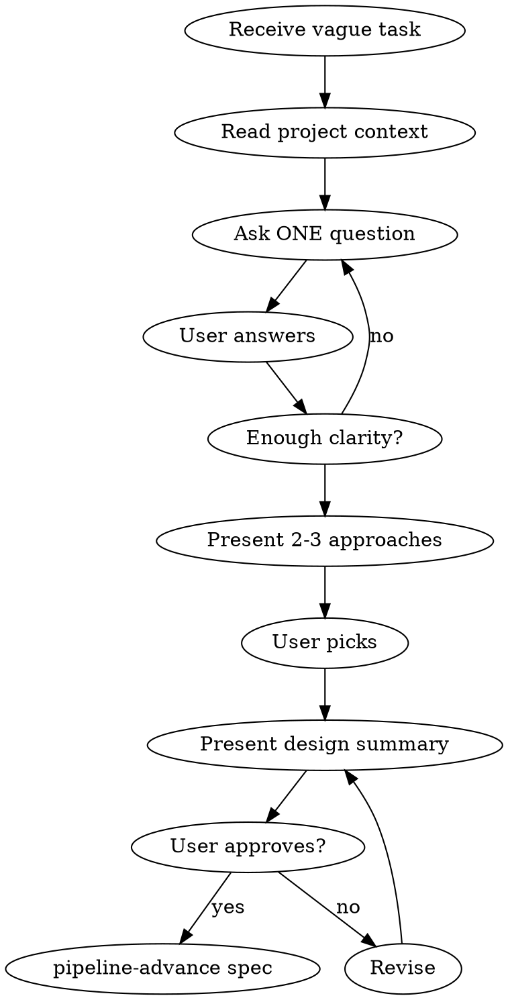

# APD Brainstorm

## The Iron Law

```
NO SPEC WITHOUT SHARED UNDERSTANDING FIRST
```

If you cannot explain the design in one sentence — you are not ready for a spec.

## When to use / When to skip

**Use when:**
- The task is vague, broad, or "improve X" style
- The user gave a destination but no path ("we need user search")
- Multiple reasonable interpretations exist
- You catch yourself making implementation choices the user hasn't seen

**Skip when:**
- The task is fully specified (file paths, function names, R-criteria)
- The user has already approved a design — write the spec-card.md directly
- You are mid-pipeline (spec is locked; raise concerns to user, don't re-brainstorm)

## Process



### 1. Read Context

- CLAUDE.md — stack, architecture
- Recent session-log — what was done before
- Existing code related to the idea

### 2. Ask One Question at a Time

**Do NOT dump a list of questions.** Ask one, wait, ask next.

Good: `What problem does this solve for the user?`

Bad:
```
1. What problem does this solve?
2. Who is the target user?
3. What's the priority?
...
```

### 3. Explore Trade-offs

When there are choices, present 2-3 options concisely:

```
Two approaches:
A) Server-rendered — simpler, faster initial load, no JS complexity
B) AJAX — smoother UX, no page reload, more JS code

Which fits better?
```

### 4. Converge on Design

When enough is clear:

```
Goal: [one sentence]
Scope: [what's included]
Out of scope: [what's not]
Approach: [technical approach]
Affected files: [list]
Adversarial budget: [max_defects=unlimited | =0 | =N]

Ready to write the spec-card.md?
```

**Adversarial budget recommendation** (writes a `adversarial: max_defects=N` line into spec-card.md, enforced by the verifier):

| R-criterion count | Recommended | Why |
|---|---|---|
| 1–7 R (default — almost all tasks) | **omit field** (= unlimited) | v6.7 rationale gate structurally catches misuse (per-finding rationale ≥40 chars + 100%-orchestrator-dismiss BLOCK). No preflight budget cap needed. |
| polish-mode (1–2 R hotfix) | `pipeline_mode: polish` | Lean preset — lower cycle caps + skip adversarial entirely. |
| Power-user explicit budget | `max_defects=N` | ONLY when ti REALLY znas budget unapred — rare. `=0` forces accept-everything which cascades into N-finding builder fix dispatches and possible cycle-cap exhaust. |

**DO NOT write `max_defects=0` for standard tasks.** Empirical evidence iz v6.8 dev cycle (2026-05-22):
- "Add contact form" (max_defects=0, 6 R): 33 min, 3 guard BLOCK cascade (max_defects-exceeded + raise-attempt + cycle-cap), 2 reset cycles.
- "Rate limit kontakt forme" (max_defects=0, 5 R): 26 min, T=8:A=8:D=0 (forced accept all 8 findings), 3 BLOCK-ova.
- "Admin lista" (NO max_defects field, 6 R): 13 min, T=10:A=1:D=9 (real adversarial work), clean run.

Default = omit field. Rationale gate (v6.7) structurally protects against rubber-stamp dismissals without forcing accept-everything cascade.

### 4b. Downstream gates the spec triggers

After spec advance, orchestrator MUST write these files. Brainstorm should mentally prepare for them:

**Implementation plan format** (writes to `.apd/pipeline/implementation-plan.md`):

```
## Implementation Plan: <task-name>

### Files to modify
**Implements:** none              ← scaffolding sections use 'none'

- src/...

### Backend
**Implements:** R1, R3            ← every dispatch section maps to R-ids

- src/api/... — endpoint changes

### Files to create
**Implements:** none

- ...
```

Every `### Section` MUST have `**Implements:**` header. `verify-plan-spec` strict mode hard-BLOCKS `apd pipeline builder` otherwise (v6.8.1+ default). Bidirectional check: every R-id from spec must appear in ≥1 section's **Implements:** line; every section must declare R-ids or `none`.

**Adversarial rationale format** (writes to `.apd/pipeline/.adversarial-rationale.md` AFTER adversarial-reviewer dispatch, BEFORE `apd pipeline verifier`):

```
## Finding 1 — <one-line title>
**Severity:** critical | important | minor
**Status:** accepted | dismissed | reviewer-self-dismissed
**Rationale:** <text ≥40 chars required for dismissed/reviewer-self-dismissed>
```

Skipping this file → v7.1 BLOCK at verifier. Plus rationale gate hard-blocks the 100%-orchestrator-dismiss pattern (T≥3 && A==0 && Do≥1) — at least one finding must be accepted OR reclassified to reviewer-self-dismissed.

### 4c. Common BLOCKs + recovery

| BLOCK reason | Likely cause | Quick fix |
|---|---|---|
| `plan-spec-consistency issues=N mode=strict` | Plan section missing `**Implements:**` header OR spec R-id unreferenced | Read the inline BLOCK template; add headers/R-ids per section; re-run `apd pipeline builder` (~10s recovery) |
| `max_defects-exceeded` | Adversarial vrati >budget findings | If budget=0 was a mistake: `apd pipeline reset "switching to unlimited"` + edit spec-card.md to remove field. If budget was intentional: accept more findings (dispatch builder fix per finding). |
| `max_defects-raised-mid-pipeline` | Tried to raise budget after spec.done | v6.3 D immutability — only `apd pipeline reset` escape. |
| `rationale-missing` | Forgot `.adversarial-rationale.md` before verifier | Write file with T entries (Finding/Severity/Status/Rationale), re-run verifier. |
| `rationale-100pct-orch-dismiss` | All findings dismissed (T≥3, A=0, Do≥1) | Accept at least one finding OR reclassify dismissed → reviewer-self-dismissed with adversarial reviewer's inline Note as Rationale. |
| `max_builder_cycles-exceeded` | Hit `.builder-count` cap (default 2) | Either accept smaller scope (lower expectations), reset + decompose into 2+ tasks, OR raise cap via spec-card `builder: max_cycles=N`. |
| `adversarial-before-reviewer` | Tried to dispatch adversarial-reviewer before reviewer.done | Dispatch code-reviewer first; advance reviewer; THEN adversarial. |

### 5. Hand Off to Spec

Do not advance the pipeline while asking questions, presenting options, or
revising the design. Once the user explicitly approves the design summary,
write spec-card.md and enter the pipeline; that advance is the only valid exit
from brainstorming:

```bash
bash .claude/bin/apd pipeline spec "Feature name"
```

<HARD-GATE>
Do NOT write code during brainstorming. Do NOT advance the pipeline mid-flow
while questions or design choices are still open. This skill produces a
DESIGN, then exits only by advancing the approved spec. Code comes from
Builder agents after the spec is approved.
</HARD-GATE>

## Red Flags — STOP

| Thought | Reality |
|---------|---------|
| "This is simple enough, skip brainstorm" | Simple tasks have hidden complexity. 5 minutes of questions saves 30 minutes of rework. |
| "I already know what they want" | You know what YOU would build. Ask what THEY want. |
| "Let me just start coding and iterate" | Iteration without direction is waste. Design first. |
| "The user seems impatient" | Users are more impatient when you build the wrong thing. |
| "I'll figure it out during implementation" | Builder agents follow specs. Vague specs produce vague code. |

## Rules

- One question at a time
- Listen more than propose
- Present trade-offs, don't decide for the user
- No code during brainstorming
- No pipeline advance while asking questions, presenting options, or revising the design
- End with a clear design that feeds into the spec

## Exit criteria

You're done when:
- The user can restate the goal in one sentence and you both agree on it
- Scope and out-of-scope are explicit and written down
- Approach is named (architectural pattern, library choice, integration point)
- Affected files are listed (not just "wherever it goes")
- The user has explicitly approved the design summary — no implicit approval
- The spec-card.md has been written and `pipeline-advance spec "<name>"` has been called as the final brainstorm action

## Hand-off

- After explicit approval → write the spec-card.md and call `pipeline-advance spec "<name>"`; this is not a mid-brainstorm advance, it is the only valid exit
- Never leads to: code, agents, implementation — those come from the builder phase
- If the user asks for "just one quick thing" mid-brainstorm → finish the brainstorm first, then queue it
