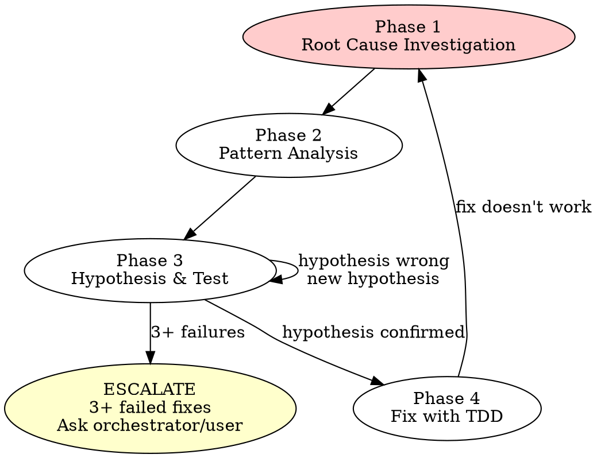

# APD Systematic Debugging

## The Iron Law

```
NO FIXES WITHOUT ROOT CAUSE INVESTIGATION FIRST
```

If you have not completed Phase 1, you CANNOT propose fixes. Guessing is not debugging. Violating the letter IS violating the spirit.

## When to use / When to skip

**Use when:**
- A test failed (unit, integration, or end-to-end)
- A build or compile failed
- The verifier blocked the pipeline
- The reviewer raised a critical finding
- You are about to re-dispatch a builder after a verifier failure (MANDATORY)

**Skip when:**
- The "failure" is actually expected behaviour (test marked skip/expected-fail)
- You haven't run the failing command yourself yet (run it first, get a real error message)
- The issue is a known intermittent and you have a tracking ticket — escalate, don't loop

## Four Phases



### Phase 1: Root Cause Investigation

**BEFORE attempting ANY fix:**

1. **Read error messages carefully** — don't skip stack traces
2. **Reproduce consistently** — can you trigger it reliably?
3. **Check recent changes** — `git diff`, recent commits
4. **Trace data flow** — where does the bad value originate?

### Phase 2: Pattern Analysis

1. **Find working examples** — similar code in the same codebase that works
2. **Compare** — what's different between working and broken?
3. **List every difference** — don't assume "that can't matter"

### Phase 3: Hypothesis and Testing

1. **State hypothesis clearly** — "I think X causes Y because Z"
2. **Test with SMALLEST change** — one variable at a time
3. **Verify** — did it work? If not, form NEW hypothesis
4. **3+ failed fixes → STOP** — escalate to orchestrator/user

### Phase 4: Fix with TDD

1. **Write failing test** reproducing the bug (use `/apd-tdd`)
2. **Implement single fix** — root cause only, no extras
3. **Verify** — test passes, no regressions

## Common Rationalizations

| Excuse | Reality |
|--------|---------|
| "Quick fix for now, investigate later" | Later never comes. The quick fix masks the real bug. |
| "It's probably X, let me fix that" | "Probably" is a guess. Verify before fixing. |
| "Just try changing X and see" | Changing random things is not debugging. Trace the data flow. |
| "I don't fully understand but this might work" | If you don't understand, your fix is random. Phase 1 first. |
| "The error message is misleading" | Maybe. But read it fully before deciding it lies. |
| "It works on my test, ship it" | Did you reproduce the ORIGINAL failure? Run the ORIGINAL failing test. |

## Red Flags — Return to Phase 1

- Proposing solutions before tracing data flow
- Changing multiple things at once
- "It's probably..." without evidence
- Copy-pasting a Stack Overflow fix without understanding it
- 3+ fixes failed and still guessing

## Quick Reference

| Phase | Do | Don't |
|-------|-----|-------|
| 1. Root Cause | Read errors, reproduce, trace | Guess, skip traces |
| 2. Pattern | Find working code, compare | Assume differences don't matter |
| 3. Hypothesis | One change, verify | Multiple changes at once |
| 4. Fix | Failing test first, single fix | Fix without test, bundle changes |

## Exit criteria

You're done when:
- Root cause is named in one sentence with file:line evidence
- Failing test reproducing the bug exists and is committed (Phase 4)
- The single targeted fix turns the failing test green
- Full test suite passes — no regressions
- No unrelated cleanup snuck into the same change

## Hand-off

- After this skill completes → resume the pipeline step that failed (re-dispatch builder, re-run verifier)
- During Phase 4 (writing the failing test) → invoke `apd-tdd`
- After 3+ failed hypotheses → escalate to user with summary of what was tried; do NOT keep guessing
