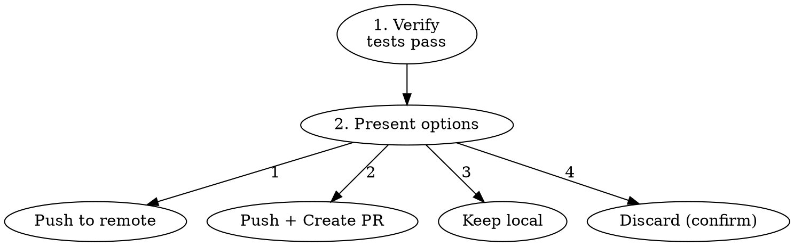

# APD Finish

## The Iron Law

```
NO PUSH WITHOUT USER DECISION FIRST
```

The pipeline produced a commit. Now the user decides what happens with it. Never auto-push, never assume.

## When to use / When to skip

**Use when:**
- A pipeline cycle just produced a successful commit
- All four pipeline steps (spec → builder → reviewer → verifier) are complete
- The user has not yet made a push/PR/keep/discard decision

**Skip when:**
- The pipeline failed before commit — go back to `apd-debug`, not finish
- The user has already pushed — there is nothing to decide
- This is a hotfix outside the pipeline — different decision flow, don't apply pipeline summary template

## Process



### Step 1: Verify

```bash
git log --oneline -1
bash "$(git rev-parse --show-toplevel)/.claude/scripts/verify-all.sh"
```

If tests fail → fix before proceeding.

### Step 2: Pipeline Report

```bash
bash "$(git rev-parse --show-toplevel)/.claude/bin/apd" report
```

Show the formatted pipeline recap so the user sees what was done before deciding.

### Step 3: Present Options

```
Pipeline complete. What would you like to do?

1. Push to remote (current branch)
2. Push and create a Pull Request
3. Keep local (I'll handle it)
4. Discard this work
```

### Step 4: Execute

#### Option 1: Push
```bash
APD_ORCHESTRATOR_COMMIT=1 git push -u origin <branch>
```

#### Option 2: Push + PR
```bash
APD_ORCHESTRATOR_COMMIT=1 git push -u origin <branch>
gh pr create --title "<feature>" --body "$(cat <<'EOF'
## Summary
<what changed>

## APD Pipeline
- Spec: approved
- Builder: <agents used>
- Reviewer: code-reviewer (opus/max) — verdict: PASS
- Verifier: all tests pass
- Pipeline duration: <time>

## Test Plan
- [ ] <verification steps>
EOF
)"
```

#### Option 3: Keep
Report branch name and status. Done.

#### Option 4: Discard
**Require typed confirmation:** "Type 'discard' to confirm."
```bash
git checkout main
git branch -D <branch>
```

## Red Flags — STOP

| Thought | Reality |
|---------|---------|
| "User probably wants me to push" | Never assume. Ask. |
| "I'll push and create PR in one go" | User might want to review locally first. |
| "Skip verification, we just ran tests" | Verify again. Something might have changed. |
| "Force push to fix the branch" | Never force push. guard-git blocks it anyway. |

## Rules

- **Never push without asking the user first**
- **Never force-push** (guard-git blocks this anyway)
- **Always verify tests** before presenting options
- **PR body must include APD pipeline summary** — proves the work was reviewed

## Exit criteria

You're done when:
- Tests have been verified from a clean state — green
- The pipeline report has been shown to the user
- The user has explicitly picked one of the four options (typed, not implied)
- The chosen option has been executed end-to-end (push completed, PR URL returned, branch deleted, etc.)
- For Discard: the user typed `discard` literally before any branch was removed

## Hand-off

- This is a **terminal skill** — when it completes, the cycle is closed
- If verification fails at Step 1 → switch to `apd-debug` (do NOT present finish options on red tests)
- After option 1/2 success → return push/PR URL to the user; do not auto-start a new pipeline
