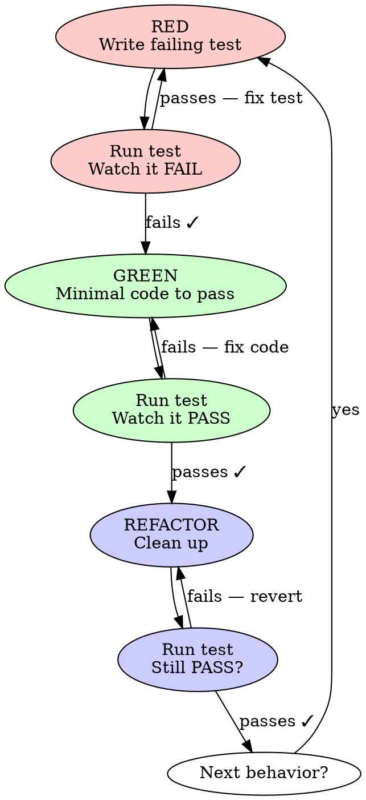

# APD Test-Driven Development

## The Iron Law

```
NO PRODUCTION CODE WITHOUT A FAILING TEST FIRST
```

Write code before the test? Delete it. Start over. No exceptions. Violating the letter IS violating the spirit.

## When to use / When to skip

**Use when:**
- You are inside the APD builder phase
- You are about to write or modify production code (any non-test source file)
- You are fixing a bug that has reached Phase 4 of `apd-debug`

**Skip when:**
- You are reading code without modifying it (use Read directly)
- You are running an existing test suite (use Bash directly)
- You are editing documentation, configuration, or scaffolding files

## Red-Green-Refactor



### 1. RED — Write Failing Test

Write ONE minimal test showing expected behavior:

```
test('deletes post by id', () => {
    // Arrange
    $repo->create(['title' => 'Test', 'url' => 'https://x.com']);
    // Act
    $result = $repo->delete(1);
    // Assert
    assertTrue($result);
    assertEmpty($repo->findAll());
});
```

**Run the test. Watch it FAIL.** If it passes — you are testing existing behavior, fix the test.

### 2. GREEN — Minimal Code to Pass

Write the SIMPLEST code that makes the test pass. Nothing more.

- No extra features
- No "while I'm here" improvements
- No over-engineering

### 3. REFACTOR — Clean Up

Only after green:
- Remove duplication
- Improve names
- Extract helpers

**Keep tests green throughout.**

### 4. REPEAT

Next failing test for next behavior.

## Common Rationalizations

| Excuse | Reality |
|--------|---------|
| "Too simple to test" | Simple code breaks. Test takes 30 seconds. |
| "I'll test after" | Tests that pass immediately prove nothing. You must WATCH them fail first. |
| "Need to explore first" | Fine. Throw away exploration code, then start with TDD. |
| "TDD will slow me down" | TDD is faster than debugging. Every time. |
| "Manual test is faster" | Manual testing doesn't prove edge cases or prevent regressions. |
| "I can't test this" | You can't test the CURRENT design. Simplify the design. |
| "The framework makes TDD hard" | Test the behavior, not the framework. Mock the boundary. |

## When Stuck

| Problem | Solution |
|---------|----------|
| Don't know how to test | Write the API you wish existed. Assert first. |
| Test too complicated | Design too complicated. Simplify. |
| Must mock everything | Code too coupled. Use dependency injection. |
| Edge case explosion | Separate input validation from business logic. Test each. |

## Red Flags — STOP

- Writing a function before its test
- Test passes on first run (you are testing existing behavior)
- Multiple behaviors in one test
- "I'll add tests at the end"
- Refactoring while tests are red

## Exit criteria

You're done when:
- Every new function has at least one test that you watched fail
- All tests pass — both new and the prior suite (no regressions)
- Edge cases are covered (empty input, invalid input, boundary values)
- No production code exists that isn't exercised by a test
- Refactor pass left tests green

## Hand-off

- After this skill completes → builder phase advances via `pipeline-advance builder`
- If a test goes red unexpectedly → switch to `apd-debug` (Phase 4 of debug uses this skill again)
- Never skip — even for "trivial" changes. Especially for trivial changes.
